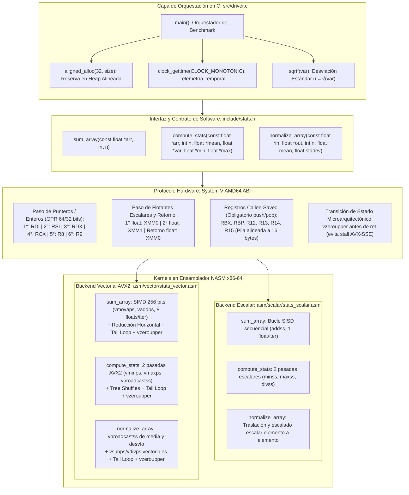

# Diagrama 1: Arquitectura de Software y Protocolo System V AMD64 ABI

Este documento formaliza la arquitectura de software modular del **Normalizador Estadístico Vectorizado (NASM x86-64 / AVX2 + C)** y detalla el contrato de interfaz binaria a bajo nivel regulado por la especificación **System V AMD64 ABI (Linux)**.

---

## 1. Visión General de la Arquitectura del Sistema

El sistema implementa una arquitectura desacoplada de alto rendimiento distribuida en dos capas complementarias:

1. **Capa de Control y Orquestación en C (`src/driver.c`):**
   - **Gestión de Memoria:** Reserva de memoria dinámica alineada a límites estrictos de 32 bytes mediante `aligned_alloc(32, size)`.
   - **E/S de Datos:** Lectura y serialización binaria de arreglos de punto flotante en disco (`input_*.dat`, `out_*.dat`).
   - **Telemetría de Precisión:** Medición microarquitectónica de tiempo de ejecución con `clock_gettime(CLOCK_MONOTONIC)`.
   - **Cómputo Complementario:** Cálculo escalar de la desviación estándar ($\sigma = \sqrt{\text{var}}$) mediante `sqrtf`.
   - **Verificación:** Validación matemática de integridad frente a tolerancias epsilon.

2. **Capa de Cómputo de Bajo Nivel en Ensamblador (`asm/`):**
   - Implementada en sintaxis NASM pura de 64 bits para arquitectura x86-64.
   - Contiene dos implementaciones intercambiables que satisfacen exactamente la misma interfaz C definida en [`include/stats.h`](file:///home/lain/Escritorio/Proyecto%201%20arqui/proyecto_vectorial/proyecto_vectorial/include/stats.h):
     - **Kernel Escalar (`asm/scalar/stats_scalar.asm`):** Implementación secuencial SISD que procesa 1 elemento por iteración sobre registros `xmm` (compilado hacia `bin/norm_scalar`).
     - **Kernel Vectorial AVX2 (`asm/vector/stats_vector.asm`):** Implementación paralela SIMD que procesa bloques de 8 floats de 32 bits (256 bits) por iteración sobre registros `ymm`, reducciones horizontales y bucle de remanente (*tail loop*) (compilado hacia `bin/norm_vector`).

---

## 2. Diagrama de Bloques de Arquitectura (Mermaid TD)

El siguiente diagrama vertical describe el flujo jerárquico desde la capa C hasta la ejecución en registros de hardware:

---

## 3. Especificación Formal: Protocolo System V AMD64 ABI

En sistemas Linux x86-64, la interacción entre C y el ensamblador se rige por el estándar **System V AMD64 ABI**. A continuación se detalla la asignación de hardware y las reglas de preservación:

### 3.1. Pasaje de Parámetros por Hardware
* **Punteros y Números Enteros:** Se transmiten ordenadamente de izquierda a derecha en los siguientes 6 registros de propósito general (GPR de 64/32 bits):
  1. `rdi` (`edi` para enteros de 32 bits)
  2. `rsi` (`esi`)
  3. `rdx` (`edx`)
  4. `rcx` (`ecx`)
  5. `r8` (`r8d`)
  6. `r9` (`r9d`)
* **Valores de Punto Flotante:** Se transmiten ordenadamente en los registros SSE/AVX:
  1. `xmm0`
  2. `xmm1`
  3. `xmm2` hasta `xmm7`
* **Retorno de Valores:**
  - Enteros/punteros: se devuelven en `rax`.
  - Flotantes escalares de precisión simple (`float`): se devuelven en el carril inferior de `xmm0`.

### 3.2. Reglas de Preservación de Registros
* **Callee-Saved (No volátiles):** `rbx`, `rbp`, `r12`, `r13`, `r14`, `r15`, y el puntero de pila `rsp`.
  - Si la función llamada requiere usar alguno de estos registros, tiene la obligación estricta de respaldarlos en la pila en su prólogo (`push`) y restaurarlos antes del retorno en su epílogo (`pop`).
  - *Aplicación en el proyecto:* La función `compute_stats` recibe 6 argumentos y necesita mantener punteros base y variables vivas a través de 2 pasadas sobre el arreglo; por ende, almacena los 6 argumentos en `r12` (`arr`), `r13d` (`n`), `r14` (`mean*`), `r15` (`var*`), `rbx` (`min*`) y `rbp` (`max*`), habiendo realizado previamente 6 instrucciones `push`.
* **Caller-Saved (Volátiles / Scratch):** `rax`, `rcx`, `rdx`, `rsi`, `rdi`, `r8`, `r9`, `r10`, `r11`, y todos los registros vectoriales `xmm0`–`xmm15` / `ymm0`–`ymm15`.
  - La función llamada puede sobrescribirlos libremente como registros de trabajo temporal, contadores o acumuladores.

### 3.3. Alineación de la Pila (Stack Alignment)
La ABI exige que inmediatamente antes de ejecutar una instrucción `call`, el puntero de pila `rsp` sea un múltiplo exacto de 16 bytes. Debido a que la instrucción `call` empuja la dirección de retorno de 8 bytes en la pila, al inicio del prólogo de la función receptora `(rsp + 8)` es múltiplo de 16. En `compute_stats`, al ejecutar exactamente 6 instrucciones `push` consecutivas de 8 bytes ($6 \times 8 = 48$ bytes), se mantiene la alineación adecuada para las operaciones internas.

---

## 4. Mapeo Exhaustivo de Funciones del Proyecto

| Función en C | Argumento / Retorno | Registro Hardware | Tipo ABI | Propósito / Semántica |
|---|---|---|---|---|
| **`sum_array(arr, n)`** | `const float *arr` | `rdi` | Caller-saved | Dirección base del arreglo alineado a 32 bytes |
| | `int n` | `esi` | Caller-saved | Tamaño del arreglo (cantidad de floats de 32 bits) |
| | **Retorno `float`** | **`xmm0`** | **Caller-saved** | **Resultado de la sumatoria acumulada** |
| **`compute_stats(arr, n, ...)`** | `const float *arr` | `rdi` $\to$ `r12` | Callee-saved | Dirección base preservada para pasadas 1 y 2 |
| | `int n` | `esi` $\to$ `r13d` | Callee-saved | Longitud del arreglo para bucles y división final |
| | `float *mean` | `rdx` $\to$ `r14` | Callee-saved | Puntero a memoria para escribir la media calculada |
| | `float *var` | `rcx` $\to$ `r15` | Callee-saved | Puntero a memoria para escribir la varianza poblacional |
| | `float *min` | `r8` $\to$ `rbx` | Callee-saved | Puntero a memoria para escribir el valor mínimo |
| | `float *max` | `r9` $\to$ `rbp` | Callee-saved | Puntero a memoria para escribir el valor máximo |
| | Retorno | `void` | N/A | Escritura directa a través de punteros desreferenciados |
| **`normalize_array(...)`** | `const float *in` | `rdi` | Caller-saved | Puntero base del arreglo original de entrada |
| | `float *out` | `rsi` | Caller-saved | Puntero base del arreglo destino de salida |
| | `int n` | `edx` | Caller-saved | Tercer entero (recibido en `edx`, no en `esi`) |
| | `float mean` | `xmm0` | Caller-saved | Media para la traslación $(x - \mu)$ |
| | `float stddev` | `xmm1` | Caller-saved | Desvío estándar para el escalado $/ \sigma$ |
| | Retorno | `void` | N/A | Transformación directa escrita en `out` |

---

## 5. Resumen de Flujo de Datos Binarios

1. **Invocación desde C:** El proceso en C coloca los punteros en los registros de enteros (`rdi`, `rsi`, `rdx`, `rcx`, `r8`, `r9`) y los parámetros en coma flotante en `xmm0`–`xmm1`, ejecutando la instrucción `call`.
2. **Cómputo en Kernel:**
   - La versión escalar opera directamente sobre registros SSE de 32 bits (`movss`, `addss`, `divss`).
   - La versión vectorial replica parámetros escalares con `vbroadcastss`, itera en bloques de 256 bits (8 floats) mediante `vmovaps` y finaliza con `vzeroupper`.
3. **Escritura y Retorno:** Los resultados escalares simples (`sum_array`) se entregan en el carril 0 de `xmm0`, mientras que las estructuras de datos complejas (`compute_stats`, `normalize_array`) escriben directamente en memoria vía punteros.
