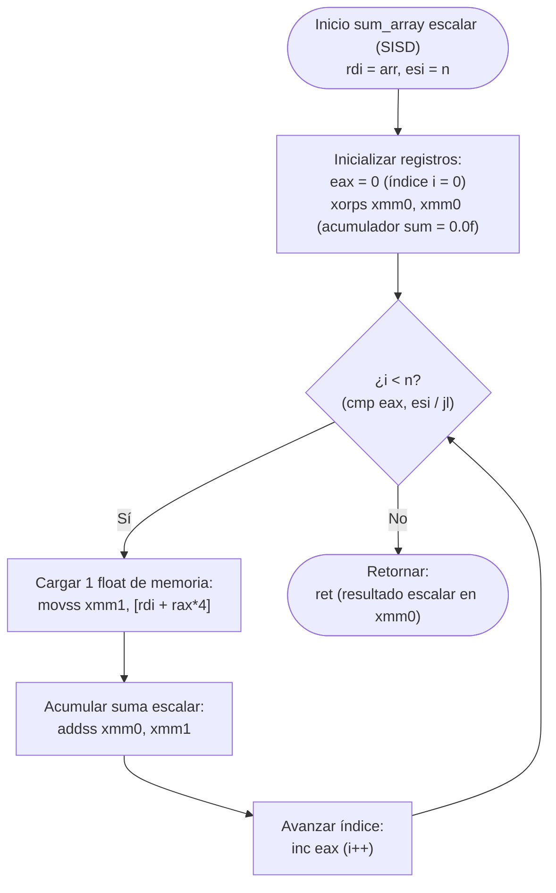
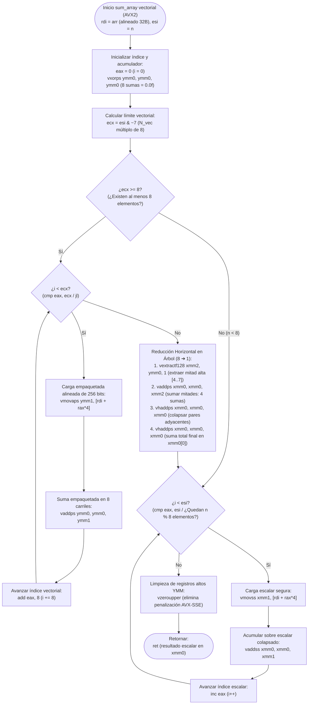
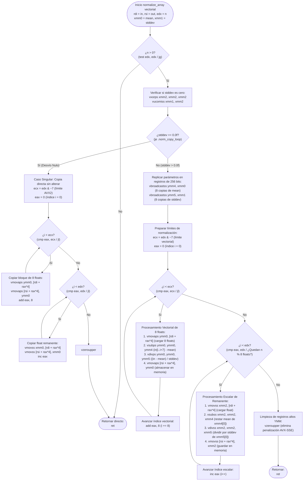

# Diagrama 2: Flujo de Control — Bucle Escalar vs Bucle Vectorial AVX2

Este documento analiza en profundidad el flujo de control, la segmentación algorítmica y la gestión de hardware entre la ejecución escalar secuencial (SISD) y la ejecución vectorial optimizada (AVX2 SIMD de 256 bits). Incluye diagramas de flujo verticales (*flowchart TD*), el cálculo bitwise del límite vectorial, la reducción horizontal en árbol, el bucle de remanente (*tail loop*), la normalización con guarda de desvío nulo y la prevención de penalizaciones microarquitectónicas mediante `vzeroupper`.

---

## 1. Fundamentos Teóricos y Comparativa de Arquitectura

| Característica | Bucle Escalar (`stats_scalar.asm`) | Bucle Vectorial AVX2 (`stats_vector.asm`) |
|---|---|---|
| **Paradigma** | SISD (Single Instruction, Single Data) | SIMD (Single Instruction, Multiple Data) |
| **Ancho de Registro** | 32 bits (`xmm`, carril escalar inferior) | 256 bits (`ymm`, 8 carriles de precisión simple) |
| **Paso de Iteración (Stride)** | $+1$ float ($+4$ bytes de memoria) | $+8$ floats ($+32$ bytes de memoria) |
| **Instrucciones Aritméticas** | `addss`, `subss`, `minss`, `maxss`, `divss` | `vaddps`, `vsubps`, `vminps`, `vmaxps`, `vdivps` |
| **Gestión de Resto ($n \pmod 8$)** | Innecesaria (procesamiento elemento a elemento) | Requiere bucle de remanente escalar (*tail loop*) |
| **Acumulación** | Directa sobre registro escalar | Acumulación paralela en 8 carriles + **Reducción Horizontal** |
| **Penalización AVX/SSE** | Inexistente (no utiliza prefijos VEX de 256 bits) | Prevenida explícitamente mediante `vzeroupper` antes de `ret` |

---

## 2. Flujograma 1: Bucle Escalar (SISD) Paso a Paso

El kernel escalar procesa los datos elemento a elemento de forma estrictamente secuencial. No requiere particionamiento de límites ni reducciones posteriores.



### Análisis del Flujo Escalar:
1. **Inicialización:** Se limpia el contador `eax` (`xor eax, eax`) y el registro acumulador `xmm0` (`xorps xmm0, xmm0`).
2. **Evaluación de Condición:** En cada iteración se compara `i` con `n` (`cmp eax, esi`).
3. **Carga y Operación:** Se transfiere un único flotante de 32 bits a `xmm1` mediante `movss` y se suma a `xmm0` con `addss`. Para `compute_stats`, esta fase computa simultáneamente `minss` y `maxss`.
4. **Avance:** El índice se incrementa en 1 (`inc eax`), saltando incondicionalmente al encabezado del bucle.
5. **Terminación:** Cuando `i >= n`, la rutina retorna de inmediato con el acumulador en el carril inferior de `xmm0`.

---

## 3. Flujograma 2: Bucle Vectorial AVX2 con Remanente (Tail Loop)

El kernel vectorial procesa bloques de 8 floats (256 bits) simultáneamente. Requiere calcular el límite múltiplo de 8 ($N_{\text{vec}} = n \ \& \ \sim 7$), verificar si hay suficientes elementos para el bucle vectorial, ejecutar una reducción horizontal en árbol y procesar los elementos restantes ($n \pmod 8$) en un bucle escalar de remanente.



### Desglose Técnico de Etapas Vectoriales:

#### 3.1. Cálculo de Límite Vectorizable y Redondeo Bitwise
Para procesar datos de a 8 elementos (256 bits / 32 bits por `float`), el procesador itera de forma vectorial sobre múltiplos de 8. El cálculo se ejecuta mediante una operación lógica binaria a nivel de bits:

$$N_{\text{vec}} = n \ \& \ (\sim 7)$$

En representación binaria sobre enteros de 32 bits:
- $7 = 00000000\_00000000\_00000000\_00000111_2$
- $\sim 7 = \text{0xFFFFFFF8} = 11111111\_11111111\_11111111\_11111000_2$

La operación AND con `~7` apaga los 3 bits menos significativos del entero $n$, truncando exactamente hacia abajo al múltiplo de 8 más cercano:
$$N_{\text{vec}} = n - (n \pmod 8)$$

Ejemplo: si $n = 23$, entonces $23 \ \& \ \sim 7 = 16$. El bucle AVX2 procesa los índices $[0 \dots 15]$ en dos iteraciones de 8 floats, y los índices restantes $[16 \dots 22]$ ($23 \pmod 8 = 7$ elementos) se procesan en el bucle de remanente escalar (*tail loop*).

#### 3.2. Árbol de Reducción Horizontal (De 8 Carriles a 1 Escalar)
Al finalizar el bucle vectorial, `ymm0` contiene 8 sumas parciales independientes:
$$\text{ymm0} = [s_0, s_1, s_2, s_3 \mid s_4, s_5, s_6, s_7]$$

El árbol logarítmico de reducción colapsa estos 8 valores en $O(\log_2 8) = 3$ etapas:
1. `vextractf128 xmm2, ymm0, 1` $\implies$ extrae los carriles superiores $[s_4, s_5, s_6, s_7]$.
2. `vaddps xmm0, xmm0, xmm2` $\implies$ suma ambas mitades: $[s_0+s_4, s_1+s_5, s_2+s_6, s_3+s_7]$.
3. `vhaddps xmm0, xmm0, xmm0` $\implies$ suma pares adyacentes dentro de los 128 bits: $[(s_0+s_4)+(s_1+s_5), (s_2+s_6)+(s_3+s_7), \dots]$.
4. `vhaddps xmm0, xmm0, xmm0` $\implies$ suma final concentrada en el carril 0 (`xmm0[0]`):
$$xmm0[0] = \sum_{k=0}^{7} s_k$$

#### 3.3. Reducción Horizontal de Mínimo y Máximo (Sin `vhminps`)
Dado que la arquitectura x86-64 no incluye una instrucción `vhminps`, la reducción horizontal de `min` y `max` en `compute_stats` se resuelve mediante permutaciones cruzadas con `vshufps`:
```nasm
    vextractf128 xmm3, ymm1, 1       ; extraer mitad superior (carriles 4..7)
    vminps  xmm1, xmm1, xmm3         ; xmm1 = min(carriles 0..3, carriles 4..7)
    vshufps xmm3, xmm1, xmm1, 0x4E   ; permuta palabras de 64 bits ([2,3,0,1])
    vminps  xmm1, xmm1, xmm3         ; colapso a 2 valores mínimos
    vshufps xmm3, xmm1, xmm1, 0xB1   ; permuta carriles de 32 bits ([1,0,3,2])
    vminps  xmm1, xmm1, xmm3         ; xmm1[0] = mínimo global de los 8 carriles
```

#### 3.4. Instrucción `vzeroupper` y Prevención de Penalización AVX-SSE
- Cuando una CPU Intel/AMD ejecuta instrucciones AVX de 256 bits, conmuta los registros internos al estado de 256 bits (*Dirty Upper State*).
- Si posteriormente se retorna a código compilado en C que ejecute instrucciones SSE tradicionales de 128 bits sin prefijo VEX, el procesador se ve forzado a pausar el pipeline y disparar microcódigo interno para resguardar la mitad alta de los registros `ymm`.
- Esta transición introduce una penalización microarquitectónica de **70 a 100 ciclos de reloj**.
- **Solución:** Ejecutar `vzeroupper` antes de `ret` pone a cero en 0–1 ciclos la mitad superior de todos los registros `ymm0`–`ymm15`, retornando al estado limpio (*Clean State*).

---

## 4. Flujograma 3: Bucle de Normalización Vectorial con `vbroadcastss` y Guarda $\sigma == 0.0$

La rutina `normalize_array` computa la transformación estándar:
$$\text{out}[i] = \frac{\text{in}[i] - \mu}{\sigma}$$

Para procesarla a velocidad AVX2, los escalares $\mu$ y $\sigma$ deben replicarse en todos los carriles mediante `vbroadcastss`. Además, debe existir una guarda estricta contra $\sigma == 0.0$ para evitar excepciones de punto flotante o valores `NaN`/`Inf`.



### Características Clave de la Normalización Vectorial:
1. **Broadcast SIMD (`vbroadcastss`):** Convierte el escalar `mean` (en `xmm0`) en un vector de 8 carriles idénticos en `ymm4` $[\mu, \mu, \mu, \mu, \mu, \mu, \mu, \mu]$, y el escalar `stddev` (en `xmm1`) en `ymm5` $[\sigma, \sigma, \sigma, \sigma, \sigma, \sigma, \sigma, \sigma]$. Esto permite que la resta y división se ejecuten en paralelo sobre los 8 elementos del vector sin requerir accesos repetidos a memoria.
2. **Guarda de Desviación Estándar Nula:** La comparación `vucomiss xmm1, xmm2` con `xmm2 = 0.0f` intercepta arreglos constantes (donde $\sigma = 0$). En este escenario, la rutina bifurca inmediatamente a una copia pura (`in[i] -> out[i]`), garantizando estabilidad numérica y evitando generar indeterminaciones `NaN` o desbordamientos `+Inf`.
3. **Persistencia del Carril Escalar Inferior:** En el bucle de remanente (*tail loop*), la instrucción `vsubss xmm2, xmm2, xmm4` reutiliza directamente el carril 0 de `ymm4` (`xmm4[0] = mean`), y `vdivss xmm2, xmm2, xmm5` reutiliza `xmm5[0] = stddev`, ahorrando instrucciones de recarga desde memoria o registros auxiliares.
4. **Epílogo Limpio:** Tanto la rama normalizada como la rama de copia terminan con `vzeroupper` antes de la instrucción `ret`.
