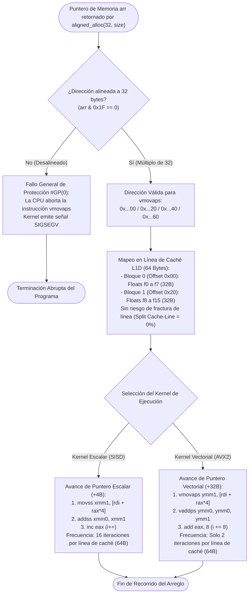

# Diagrama 4: Disposición de Memoria Física, Alineación a 32 Bytes y Stride

Este documento analiza la arquitectura de memoria física, el requisito de alineación estricta a 32 bytes impuesto por el conjunto de instrucciones AVX2 (`vmovaps`), su correspondencia con las líneas de caché de 64 bytes de la CPU y el contraste del patrón de avance (*stride*) entre el modo escalar (4B) y el modo vectorial (32B).

---

## 1. El Requisito de Alineación a 32 Bytes y la Instrucción `vmovaps`

En la microarquitectura x86-64, la instrucción **`vmovaps`** (*Vector Move Aligned Packed Single-Precision*) transfiere 256 bits (8 valores `float` de 32 bits contiguos) entre la memoria principal y un registro vectorial `ymm`.

### 1.1. Contrato de Hardware y Fallo General de Protección `#GP(0)`
A diferencia de `vmovups` (versión no alineada que tolera cualquier offset), `vmovaps` exige que la dirección de memoria sea un **múltiplo estricto de 32 bytes**:

$$\text{Dirección} \equiv 0 \pmod{32}$$

Si el procesador intenta ejecutar `vmovaps` sobre una dirección no divisible por 32 (por ejemplo, una dirección desplazada en 4 bytes por un puntero desalineado), la unidad de gestión de memoria (MMU) de la CPU interrumpe la ejecución disparando una **excepción de Fallo General de Protección (`#GP(0)`)**. El kernel Linux captura esta señal de hardware y finaliza el proceso emitiendo `SIGSEGV` (*Segmentation Fault*).

### 1.2. Máscara de Bits (Bitmasking)
Dado que $32 = 2^5$, una dirección de memoria está alineada a 32 bytes si y solo si sus **5 bits menos significativos son exactamente cero**:

$$\text{Dirección Virtual} \ \& \ \text{0x1F} == 0$$

| Dirección Virtual de Ejemplo | Dígitos Hexadecimales Finales | Últimos 5 bits binarios | Estado de Alineación | Comportamiento con `vmovaps` |
|---|---|---|---|---|
| `0x555555559000` | `...00` | `00000` | **Alineada (Múltiplo de 32)** | **Éxito (1 ciclo L1D)** |
| `0x555555559020` | `...20` | `00000` | **Alineada (Múltiplo de 32)** | **Éxito (1 ciclo L1D)** |
| `0x555555559040` | `...40` | `00000` | **Alineada (Múltiplo de 32)** | **Éxito (1 ciclo L1D)** |
| `0x555555559060` | `...60` | `00000` | **Alineada (Múltiplo de 32)** | **Éxito (1 ciclo L1D)** |
| `0x555555559004` | `...04` | `00100` | **Desalineada (+4 bytes)** | **Fallo de Hardware `#GP(0)` $\to$ `SIGSEGV`** |
| `0x555555559008` | `...08` | `01000` | **Desalineada (+8 bytes)** | **Fallo de Hardware `#GP(0)` $\to$ `SIGSEGV`** |

En formato hexadecimal, toda dirección virtual alineada a 32 bytes finaliza invariablemente en uno de los siguientes 8 dígitos:
$$\text{0x00, 0x20, 0x40, 0x60, 0x80, 0xA0, 0xC0, 0xE0}$$

---

## 2. Mapa Estructurado de Memoria y Líneas de Caché (64 Bytes)

En procesadores modernos x86-64 (Intel Core / AMD Ryzen), la línea de caché de Nivel 1 de Datos (L1D Cache Line) tiene una longitud de **64 bytes**. Un bloque de caché contiene exactamente **16 flotantes de precisión simple (32 bits cada uno)**.

### 2.1. Diagrama ASCII de Mapeo Físico de Caché y Bloques AVX2

```
====================================================================================================
                        LÍNEA DE CACHÉ L1D #0 (64 BYTES / 16 FLOATS)
                             Dirección Base: 0x...00 hasta 0x...3F
----------------------------------------------------------------------------------------------------
  MITAD INFERIOR (32 BYTES): BLOQUE AVX2 #0           MITAD SUPERIOR (32 BYTES): BLOQUE AVX2 #1
         Offset: +0x00 (Dir: 0x...00)                         Offset: +0x20 (Dir: 0x...20)
       Registro Destino: ymm1 (Iteración k)               Registro Destino: ymm1 (Iteración k+8)
--------------------------------------------------   -----------------------------------------------
 [f0] [f1] [f2] [f3] [f4] [f5] [f6] [f7]             [f8] [f9] [f10] [f11] [f12] [f13] [f14] [f15]
  4B   4B   4B   4B   4B   4B   4B   4B                4B   4B   4B    4B    4B    4B    4B    4B
====================================================================================================
                        LÍNEA DE CACHÉ L1D #1 (64 BYTES / 16 FLOATS)
                             Dirección Base: 0x...40 hasta 0x...7F
----------------------------------------------------------------------------------------------------
  MITAD INFERIOR (32 BYTES): BLOQUE AVX2 #2           MITAD SUPERIOR (32 BYTES): BLOQUE AVX2 #3
         Offset: +0x40 (Dir: 0x...40)                         Offset: +0x60 (Dir: 0x...60)
      Registro Destino: ymm1 (Iteración k+16)             Registro Destino: ymm1 (Iteración k+24)
--------------------------------------------------   -----------------------------------------------
 [f16] [f17] [f18] [f19] [f20] [f21] [f22] [f23]     [f24] [f25] [f26] [f27] [f28] [f29] [f30] [f31]
  4B    4B    4B    4B    4B    4B    4B    4B         4B    4B    4B    4B    4B    4B    4B    4B
====================================================================================================
```

### 2.2. Prevención Total de Fractura de Línea de Caché (*Split Cache-Line*)
- Si un vector de 32 bytes estuviese desalineado (por ejemplo, comenzando en el byte 48 de la Línea #0), sus primeros 16 bytes residirían en la Línea #0 y los siguientes 16 bytes en la Línea #1.
- Esto provocaría una **fractura de línea de caché (*split cache line*)**, forzando a la CPU a emitir dos accesos a bus L1, duplicar traducciones TLB y generar contención en los buffers de llenado (*Line Fill Buffers*).
- **Garantía con alineación a 32 bytes:** Cada lectura vectorial de 256 bits ocupa de forma indivisible la mitad inferior (bytes 0..31) o superior (bytes 32..63) de una única línea de caché. La probabilidad de cruzar un límite de 64 bytes es estrictamente **0.0%**.

---

## 3. Contraste de Avance de Puntero (Stride): 4B Escalar vs 32B Vectorial

El avance de puntero en memoria determina la frecuencia de saltos condicionales, la presión sobre el branch predictor y el aprovechamiento del hardware prefetcher.

```
PATRÓN DE AVANCE ESCALAR (SISD) — Stride = +4 Bytes (1 Float)
Iteración:   0    1    2    3    4    5    6    7    8    9   10   11   12   13   14   15
Puntero:   | 4B | 4B | 4B | 4B | 4B | 4B | 4B | 4B | 4B | 4B | 4B | 4B | 4B | 4B | 4B | 4B |
Instrucción:  movss xmm1, [rdi + rax*4]  (Se ejecuta 16 veces por cada línea de 64 bytes)
Overhead:     16 comparaciones (cmp) + 16 saltos condicionales (jge) por cada 64 bytes.

----------------------------------------------------------------------------------------------------

PATRÓN DE AVANCE VECTORIAL AVX2 (SIMD) — Stride = +32 Bytes (8 Floats)
Iteración: [--------- Iteración k (add eax, 8) ---------] [------- Iteración k+8 (add eax, 8) -------]
Puntero:   |                      32 Bytes                      |                      32 Bytes                      |
Instrucción:  vmovaps ymm1, [rdi + rax*4]                         vmovaps ymm1, [rdi + rax*4]
Overhead:     Solo 2 comparaciones (cmp) y 2 saltos por cada 64 bytes (Reducción de overhead: 87.5%).
```

### Tabla Comparativa de Rendimiento de Memoria

| Métrica Microarquitectónica | Kernel Escalar (`stats_scalar.asm`) | Kernel Vectorial AVX2 (`stats_vector.asm`) | Impacto del Enfoque Vectorial |
|---|---|---|---|
| **Paso de Puntero (Stride)** | $+4$ bytes ($+1$ elemento) | $+32$ bytes ($+8$ elementos) | **$8\times$ más avance por ciclo** |
| **Instrucción de Carga** | `movss` (32 bits) | `vmovaps` (256 bits alineados) | **$8\times$ mayor ancho de banda L1D** |
| **Iteraciones por Línea de Caché (64B)** | 16 iteraciones | 2 iteraciones | **87.5% menos evaluaciones de bucle** |
| **Presión sobre Branch Predictor** | 16 bifurcaciones por línea de caché | 2 bifurcaciones por línea de caché | Mínimo riesgo de *branch misprediction* |
| **Límite de Ancho de Banda** | Subutiliza el bus L1D (4B de 64B por ciclo) | Llena la mitad del bus L1D (32B por ciclo) | Saturación óptima de puertos de carga 2 y 3 |
| **Sinergia con HW Prefetcher** | Acceso secuencial denso | Acceso secuencial a zancadas de 32B | El L2 Streamer precarga líneas contiguas |

---

## 4. Diagrama de Flujo y Validación de Memoria (Mermaid TD)

El siguiente diagrama vertical sintetiza la validación de direcciones, la división de líneas de caché y la bifurcación según el patrón de recorrido:



---

## 5. Implementación de Reserva Alineada en C (`src/driver.c`)

Para asegurar que los arreglos satisfagan el invariante $\text{addr} \ \& \ \text{0x1F} == 0$, el orquestador C en [`src/driver.c`](file:///home/lain/Escritorio/Proyecto%201%20arqui/proyecto_vectorial/proyecto_vectorial/src/driver.c) utiliza la función estándar C11 `aligned_alloc`:

```c
#define VEC_ALIGN 32 /* bytes: requerido por vmovaps para AVX2 (256 bits) */

static float *alloc_aligned_floats(size_t count) {
    size_t bytes = count * sizeof(float);
    /* Redondear la cantidad de bytes al múltiplo superior de 32 bytes */
    size_t padded = ((bytes + VEC_ALIGN - 1) / VEC_ALIGN) * VEC_ALIGN;
    if (padded == 0) padded = VEC_ALIGN;

    float *p = aligned_alloc(VEC_ALIGN, padded);
    if (!p) {
        fprintf(stderr, "Error: no se pudo reservar memoria alineada.\n");
        exit(EXIT_FAILURE);
    }
    memset(p, 0, padded);
    return p;
}
```

### Garantías Arquitectónicas Obtenidas:
1. **Alineación Base Estricta:** La dirección base `p` devuelta tiene garantizados sus 5 bits inferiores en cero, permitiendo invocar directamente `vmovaps` sin penalizaciones ni excepciones `#GP(0)`.
2. **Acolchonamiento Seguro (*Padding*):** Si $n$ no es múltiplo de 8, la reserva se expande al siguiente múltiplo de 32 bytes. Esto previene que una lectura vectorial final cruce a una página física desasignada, blindando la ejecución contra violaciones de segmento.
3. **Cero Penalizaciones de Caché:** La tasa de aciertos de L1D se maximiza gracias a la contigüidad espacial y la activación automática de los prefetchers de hardware L1/L2.
