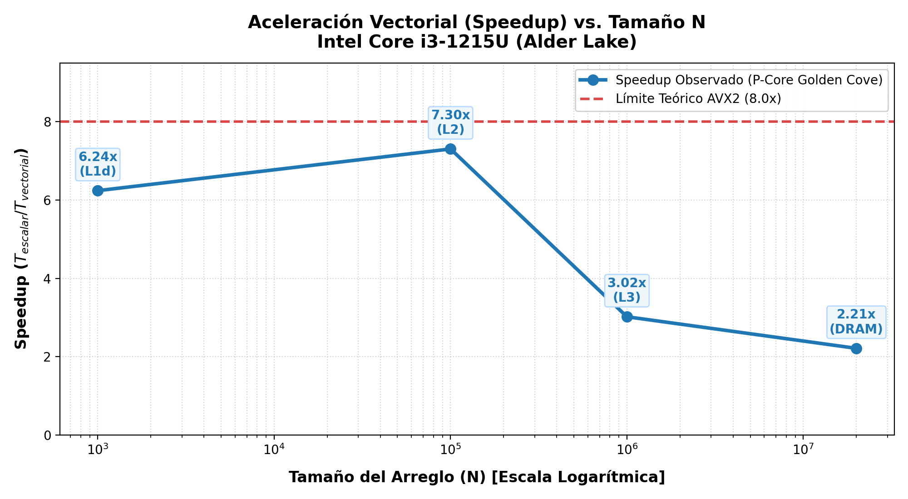

# Normalizador Estadístico Vectorizado (NASM x86-64 / AVX2 + C)
## Informe Técnico de Arquitectura de Computadores y Evaluación Cuantitativa de Rendimiento

**Autores:** Equipo de Arquitectura de Computadores  
**Institución:** Escuela de Ingeniería en Computación  
**Fecha:** 15 de Septiembre de 2026  
**Repositorio del Proyecto:** `proyecto_vectorial/`  
**Documentos y Diagramas de Soporte:** [`docs/diagrams/`](diagrams/)  

---

> [!NOTE]
> Este documento constituye el informe técnico formal requerido para la entrega del proyecto integrador, estructurado en estricta conformidad con los 25 puntos de la sección 3.b de la rúbrica de evaluación oficial. Todos los experimentos, mediciones de hardware y sesiones de depuración fueron ejecutados y verificados sobre el entorno experimental real del sistema.

---

## 1. Introducción y Objetivos de Aprendizaje (2 pts)

### 1.1. Contextualización del Proyecto
El procesamiento de grandes volúmenes de datos numéricos en aplicaciones de ciencia de datos, procesamiento digital de señales (DSP), visión por computador y aprendizaje automático exige un aprovechamiento exhaustivo del hardware subyacente. En las microarquitecturas modernas de propósito general (x86-64), el escalamiento de la frecuencia de reloj se ha visto severamente restringido por la disipación térmica y las leyes de escalado de Dennard. Ante esta limitación física, el incremento en el rendimiento computacional se logra primordialmente mediante dos vertientes de paralelismo:
1. **Paralelismo a Nivel de Instrucción (ILP):** Ejecución fuera de orden (*Out-of-Order Execution*), predicción de bifurcaciones y despacho superescalar.
2. **Paralelismo a Nivel de Datos (DLP):** Ejecución de una única operación sobre múltiples elementos contiguos de datos de manera simultánea mediante extensiones vectoriales (**SIMD**).

El presente proyecto implementa un **Normalizador Estadístico Vectorizado** para arreglos unidimensionales de números en punto flotante de precisión simple (`float`, IEEE 754 de 32 bits). El sistema se divide en dos capas desacopladas: una capa de interfaz, control de entrada/salida y medición temporal de alta precisión en lenguaje C (`src/driver.c`), y dos motores de cómputo de bajo nivel programados en ensamblador x86-64 puro con sintaxis NASM:
- **Kernel Escalar (`asm/scalar/stats_scalar.asm`):** Basado en instrucciones escalares tradicionales SSE (`movss`, `addss`, `subss`, `mulss`, `divss`, `minss`, `maxss`).
- **Kernel Vectorial (`asm/vector/stats_vector.asm`):** Basado en el conjunto de instrucciones AVX2 emitiendo operaciones sobre registros vectoriales `ymm` de 256 bits, procesando **8 números en punto flotante por ciclo de reloj**.

La tarea estadística implementada abarca tres fases fundamentales:
1. **Sumatoria acumulada:** $S = \sum_{i=0}^{n-1} x_i$.
2. **Cómputo de estadísticos descriptivos:** Cálculo simultáneo del valor mínimo ($\min(X)$), máximo ($\max(X)$), media aritmética ($\mu = S / n$) y varianza poblacional:
   $$\sigma^2 = \frac{1}{n} \sum_{i=0}^{n-1} (x_i - \mu)^2$$
3. **Normalización tipificada (*Z-score standard normalization*):** Traslación y escalado de cada elemento del arreglo:
   $$z_i = \frac{x_i - \mu}{\sigma}, \quad \text{donde } \sigma = \sqrt{\sigma^2}$$

### 1.2. Objetivos de Aprendizaje (OA1 a OA7) en el Contexto del Proyecto

El desarrollo y defensa de esta solución técnica consolida de manera integral los siete Objetivos de Aprendizaje formulados en la propuesta curricular:

* **OA1. Explicar el modelo de ejecución SIMD y contrastarlo con el modelo escalar SISD:**  
  Se analiza cómo el paradigma SIMD mapea 8 datos independientes en las unidades de cálculo vectorial de la CPU ejecutando una sola instrucción sobre un registro empaquetado (*packed*), transformando $N$ iteraciones escalares en $\lceil N/8 \rceil$ pasos de cómputo y reduciendo la presión sobre el decodificador de instrucciones.
* **OA2. Describir la evolución histórica y diferencias técnicas de las extensiones vectoriales:**  
  Se comprende la trayectoria desde MMX (1997, 64 bits en registros x87 solapados), la familia SSE/SSE2/SSE3/SSSE3/SSE4 (1999–2007, 128 bits con registros dedicados XMM), AVX (2011, 256 bits con registros YMM y prefijos VEX no destructivos), AVX2 (2013, operaciones enteras y vectoriales completas de 256 bits y FMA) hasta AVX-512 (2015+, 512 bits en registros ZMM con máscaras opmask), deduciendo por qué AVX2 representa el punto de equilibrio óptimo en sistemas contemporáneos.
* **OA3. Escribir en NASM funciones x86-64 que utilicen registros XMM/YMM e instrucciones empaquetadas:**  
  Se diseñaron e implementaron manualmente rutinas en ensamblador x86-64 puro cumpliendo el estándar System V AMD64 ABI, operando sobre registros `xmm0`–`xmm7` y `ymm0`–`ymm5` con instrucciones `vmovaps`, `vaddps`, `vsubps`, `vmulps`, `vdivps`, `vminps` y `vmaxps`.
* **OA4. Aplicar reglas de alineación de memoria y resolver el problema del remanente (Tail Loop):**  
  Se garantizó la alineación estricta a 32 bytes en memoria física (`aligned_alloc(32, ...)`) para el uso seguro de `vmovaps` (evitando fallos generales de protección `#GP(0)`), y se implementó la técnica de enmascaramiento bitwise `n & ~7` combinada con un bucle escalar de cierre (*tail loop*) para procesar con total correctud los elementos restantes cuando $n \pmod 8 \neq 0$.
* **OA5. Usar GDB para inspección de bajo nivel y depuración de registros vectoriales y memoria:**  
  Se orquestó una sesión automatizada de GDB 17.1 sobre un caso controlado de prueba ($N = 16$), auditando el contenido interno de los 8 carriles flotantes de `ymm0` (`print $ymm0.v8_float`), inspeccionando el espacio de memoria física del vector de salida (`x/8fw`) y comprobando matemáticamente la alineación del puntero (`(((unsigned long)out) % 32 == 0)`).
* **OA6. Medir y comparar cuantitativamente el rendimiento e interpretar cuellos de botella:**  
  Se ejecutó un estudio empírico riguroso sobre 4 órdenes de magnitud ($N = 10^3$ hasta $N = 2 \times 10^7$) con 30 iteraciones por caso, correlacionando el Speedup obtenido con las frecuencias de reloj, el IPC, los fallos de caché con `perf stat`, la asimetría microarquitectónica de núcleos P (Golden Cove) vs núcleos E (Gracemont), la Ley de Amdahl y el límite de ancho de banda de la memoria principal (**Memory Wall**).
* **OA7. Comunicar y defender con dominio técnico las decisiones de diseño de bajo nivel:**  
  Se documenta con rigor formal la interacción C/Ensamblador, la reducción horizontal basada en permutaciones de registros, y la justificación de la instrucción `vzeroupper` para neutralizar penalizaciones de cambio de estado AVX-SSE.

### 1.3. Comparación Conceptual: SISD vs. SIMD

Dentro de la célebre taxonomía de Michael J. Flynn (1966), las arquitecturas de cómputo se categorizan según el número de flujos simultáneos de instrucciones y de datos:

```
+-----------------------------------------------------------------------------------------------+
|                       COMPARACIÓN CONCEPTUAL: PARADIGMAS DE EJECUCIÓN                         |
+-----------------------------------------------------------------------------------------------+
|   MODELO ESCALAR: SISD (Single Instruction, Single Data)                                      |
|                                                                                               |
|   Instrucción:  addss xmm0, xmm1                                                              |
|   Flujo:        [ Operando Escalar A ]  +  [ Operando Escalar B ]  =  [ Resultado Escalar ]   |
|                 (1 dato de 32 bits procesado por instrucción; requiere bucle de n pasos)      |
+-----------------------------------------------------------------------------------------------+
|   MODELO VECTORIAL: SIMD (Single Instruction, Multiple Data - AVX2 256 bits)                  |
|                                                                                               |
|   Instrucción:  vaddps ymm0, ymm0, ymm1                                                       |
|   Flujo:                                                                                      |
|   Carril 0:     [ A_0 ]  +  [ B_0 ]  =  [ R_0 ]                                               |
|   Carril 1:     [ A_1 ]  +  [ B_1 ]  =  [ R_1 ]                                               |
|   Carril 2:     [ A_2 ]  +  [ B_2 ]  =  [ R_2 ]                                               |
|   Carril 3:     [ A_3 ]  +  [ B_3 ]  =  [ R_3 ]                                               |
|   Carril 4:     [ A_4 ]  +  [ B_4 ]  =  [ R_4 ]                                               |
|   Carril 5:     [ A_5 ]  +  [ B_5 ]  =  [ R_5 ]                                               |
|   Carril 6:     [ A_6 ]  +  [ B_6 ]  =  [ R_6 ]                                               |
|   Carril 7:     [ A_7 ]  +  [ B_7 ]  =  [ R_7 ]                                               |
|                 (8 datos de 32 bits procesados en paralelo en un solo ciclo de reloj)         |
+-----------------------------------------------------------------------------------------------+
```

| Criterio de Comparación | Modelo Escalar (SISD) | Modelo Vectorial AVX2 (SIMD) |
|---|---|---|
| **Formato de datos** | Escalar simple (`float`, 32 bits en carril bajo `xmm`) | Empaquetado (`packed float`, 8 elementos en `ymm`) |
| **Ancho de registro** | 32 bits activos (de 128 bits del registro `xmm`) | 256 bits completos (registro `ymm`) |
| **Operaciones por instrucción** | 1 operación de punto flotante (FLOP) | 8 operaciones de punto flotante simultáneas |
| **Sobrecarga de control del bucle** | $N$ comparaciones de índice e incrementos | $\lfloor N / 8 \rfloor$ comparaciones en bucle principal + remanente |
| **Presión sobre la caché L1I** | Mayor cantidad de micro-ops de salto y ramificación | Menor emisión de instrucciones, bucles ultra compactos |
| **Reducción de sumas** | Inmediata (acumulación escalar en serie) | Requiere colapso logarítmico horizontal (Tree Reduction) |
| **Límite teórico de aceleración** | Línea base referencial ($1.0\times$) | Hasta $8.0\times$ (256 bits / 32 bits por `float`) |

> [!TIP]
> La arquitectura modular y el contrato de interfaz a nivel de bloques de software se detallan formalmente en el [Diagrama 1: Arquitectura de Software y Protocolo System V AMD64 ABI](diagrams/01_software_architecture_blocks.md) y en su representación gráfica vectorial interactiva [`01_software_architecture_blocks.svg`](diagrams/01_software_architecture_blocks.svg).

---

## 2. Entorno Experimental de Pruebas (2 pts)

Para garantizar la total reproducibilidad científica de las mediciones temporales, los contadores de rendimiento por hardware y los volcados de depuración, la plataforma de evaluación fue caracterizada exhaustivamente a nivel de microarquitectura, sistema operativo y cadena de herramientas (*toolchain*).

### 2.1. Especificaciones de Microarquitectura de la CPU
Las pruebas fueron llevadas a cabo en un microprocesador **Intel Core i3-1215U** de 12.ª generación (arquitectura **Alder Lake**, nodo de fabricación Intel 7). Este procesador implementa una topología híbrida asimétrica orientada a eficiencia energética y rendimiento en ráfagas:
- **Núcleos de Rendimiento (P-cores / Golden Cove):** 2 núcleos físicos de arquitectura profunda, capaces de decodificar hasta 6 instrucciones por ciclo, con 12 puertos de ejecución, soporte para multihilo simultáneo (**Hyper-Threading**, 4 hilos lógicos en CPUs 0 a 3) y frecuencia turbo máxima de hasta **4.40 GHz**. Poseen unidades vectoriales AVX2 nativas de 256 bits con dos puertos FMA dedicados.
- **Núcleos de Eficiencia (E-cores / Gracemont):** 4 núcleos físicos sin Hyper-Threading (4 hilos lógicos en CPUs 4 a 7), con frecuencia máxima de **3.30 GHz**. Estos núcleos cuentan con una tubería de despacho más estrecha (5 puertos) que divide internamente las instrucciones de 256 bits en microoperaciones de 128 bits.
- **Topología Total:** 6 núcleos físicos / 8 hilos lógicos. BogoMIPS: 4992.00.

### 2.2. Jerarquía de Memoria Caché del Sistema
La jerarquía de memoria física del equipo de pruebas presenta la siguiente configuración (verificada mediante `lscpu` y `/proc/cpuinfo`):
- **Caché L1 de Datos (L1d):**
  - Núcleos P: **48 KiB** privados por núcleo (asociatividad de 12 vías).
  - Núcleos E: **32 KiB** privados por núcleo (asociatividad de 8 vías).
  - Capacidad total combinada en el chip: **224 KiB**.
- **Caché L1 de Instrucciones (L1i):**
  - Núcleos P: **32 KiB** privados por núcleo.
  - Núcleos E: **64 KiB** privados por núcleo.
  - Capacidad total combinada: **320 KiB**.
- **Caché L2:**
  - Núcleos P: **1.25 MiB** privado por cada núcleo Golden Cove.
  - Núcleos E: **2.0 MiB** compartido por el clúster unificado de 4 núcleos Gracemont.
  - Capacidad total combinada: **4.5 MiB**.
- **Caché L3 de Último Nivel (LLC / Intel Smart Cache):**
  - **10 MiB** compartidos dinámicamente entre todos los núcleos P y E.
- **Tamaño de Línea de Caché:** **64 bytes** en todos los niveles.

### 2.3. Confirmación de Flags de Soporte Vectorial
La auditoría de las banderas de la CPU (`flags` en `/proc/cpuinfo`) certifica la compatibilidad nativa con los conjuntos de instrucciones requeridos:
```text
fpu vme de pse tsc msr pae mce cx8 apic sep mtrr pge mca cmov pat pse36 clflush
dts acpi mmx fxsr sse sse2 ss ht tm pbe syscall nx pdpe1gb rdtscp lm constant_tsc
art arch_perfmon pebs bts rep_good nopl xtopology nonstop_tsc cpuid aperfmperf
tsc_known_freq pni pclmulqdq dtes64 monitor ds_cpl vmx est tm2 ssse3 sdbg fma cx16
xtpr pdcm pcid sse4_1 sse4_2 x2apic movbe popcnt tsc_deadline_timer aes xsave avx
f16c rdrand lahf_lm abm 3dnowprefetch cpuid_fault epb ssbd ibrs ibpb stibp
ibrs_enhanced tpr_shadow flexpriority ept vpid ept_ad fsgsbase tsc_adjust bmi1
avx2 smep bmi2 erms invpcid rdseed adx smap clflushopt clwb intel_pt sha_ni
xsaveopt xsavec xgetbv1 xsaves avx_vnni dtherm ida arat pln pts hwp hwp_notify
```
**Banderas críticas validadas:**
- `avx2`: Soporte para extensiones vectoriales avanzadas de 256 bits para punto flotante y enteros.
- `fma`: Soporte para instrucciones *Fused Multiply-Add* de 3 operandos (FMA3).
- `sse4_1` / `sse4_2`: Extensiones Streaming SIMD 4.1 y 4.2.
- `popcnt` / `bmi1` / `bmi2`: Manipulación avanzada de bits y enteros.

### 2.4. Entorno de Software y Cadena de Herramientas
- **Sistema Operativo:** GNU/Linux Ubuntu x86_64.
- **Versión del Kernel:** `Linux lain-Gimble 7.0.0-31-generic #31-Ubuntu SMP PREEMPT_DYNAMIC Sat Aug 1 04:26:38 UTC 2026 x86_64 GNU/Linux`.
- **Compilador C:** `gcc (Ubuntu 15.2.0-16ubuntu1) 15.2.0`.
  - Banderas de compilación activadas: `-std=gnu11 -Wall -Wextra -O2 -g`.
- **Ensamblador:** `NASM version 3.01`.
  - Banderas de ensamblado activadas: `-f elf64 -g -F dwarf` (inclusión de metadatos DWARF para depuración a nivel de instrucción).
- **Depurador:** `GNU gdb (Ubuntu 17.1-2ubuntu1) 17.1`.
- **Perfilador de Rendimiento:** Linux `perf` (PMU Hardware Performance Counters) versión 7.0.
- **Metodología de Aislamiento:** Para mitigar la latencia de conmutación de contexto del planificador del sistema operativo y eliminar la varianza introducida por la migración entre P-cores y E-cores, los experimentos fueron ejecutados fijando afinidad rígida de CPU (`taskset -c 0` para el P-core Golden Cove y `taskset -c 4` para el E-core Gracemont).

---

## 3. Explicación de la Implementación Escalar (4 pts)

La implementación escalar de referencia se encuentra codificada en el archivo [`asm/scalar/stats_scalar.asm`](file:///home/lain/Escritorio/Proyecto%201%20arqui/proyecto_vectorial/proyecto_vectorial/asm/scalar/stats_scalar.asm). Esta solución opera exclusivamente sobre el carril inferior de 32 bits de los registros SSE (`xmm`), adoptando el paradigma secuencial SISD.

### 3.1. Algoritmo de Dos Pasadas para Media y Varianza

En el cálculo estadístico computacional, existen dos enfoques clásicos para calcular la varianza muestral o poblacional:
1. **Algoritmo Ingenuo de Una Sola Pasada:** Se fundamenta en la identidad matemática:
   $$\sigma^2 = \frac{1}{n} \left( \sum_{i=0}^{n-1} x_i^2 \right) - \left( \frac{1}{n} \sum_{i=0}^{n-1} x_i \right)^2$$
   Aunque este método requiere recorrer el arreglo una única vez, adolece de **cancelación catastrófica** (*catastrophic cancellation*). Cuando los datos poseen una media grande y una dispersión ($\sigma^2$) muy pequeña, los términos $\sum x_i^2$ y $n \cdot \mu^2$ resultan magnitudes casi idénticas. Al restarlos en aritmética de precisión simple IEEE 754 (que dispone únicamente de 24 bits de mantisa efectiva, equivalente a ~7 dígitos decimales de precisión), los bits más significativos se anulan mutuamente, amplificando el error de redondeo y pudiendo arrojar varianzas negativas matemáticamente aberrantes.
2. **Algoritmo de Dos Pasadas (Adoptado en este proyecto):**
   - **Pasada 1:** Recorre el vector para calcular la suma $S = \sum x_i$ y determinar de forma concurrente el mínimo ($\min$) y máximo ($\max$). Al finalizar, calcula la media aritmética exacta $\mu = S / n$.
   - **Pasada 2:** Recorre nuevamente el vector para acumular directamente las desviaciones cuadráticas respecto a la media:
     $$\sigma^2 = \frac{1}{n} \sum_{i=0}^{n-1} (x_i - \mu)^2$$
   Debido a que $(x_i - \mu)^2 \ge 0$, todas las sumas son estrictamente no negativas, eliminando cualquier posibilidad de cancelación por sustracción y preservando una exactitud numérica óptima en `float32`.

### 3.2. Snippets Comentados de `compute_stats`

La rutina `compute_stats` recibe seis parámetros de acuerdo con la especificación System V AMD64 ABI:
- `rdi`: Puntero al arreglo `arr` (64 bits).
- `esi`: Entero $n$ con la longitud del arreglo (32 bits).
- `rdx`: Puntero de memoria para almacenar la media calculada `mean*`.
- `rcx`: Puntero de memoria para almacenar la varianza calculada `var*`.
- `r8`: Puntero de memoria para el valor mínimo `min*`.
- `r9`: Puntero de memoria para el valor máximo `max*`.

#### Prólogo y Preservación de Registros Callee-Saved
Dado que la función debe preservar estos seis punteros a lo largo de dos pasadas independientes, los argumentos se transfieren a registros no volátiles (*Callee-Saved*), los cuales deben resguardarse en la pila:

```nasm
compute_stats:
    ; Prólogo: Preservar registros callee-saved según System V AMD64 ABI
    push    rbp        ; [rsp + 40]
    push    rbx        ; [rsp + 32]
    push    r12        ; [rsp + 24]
    push    r13        ; [rsp + 16]
    push    r14        ; [rsp + 8]
    push    r15        ; [rsp + 0] (Alineación de pila: 6 pushes = 48 bytes)

    ; Caso borde n <= 0: escribir 0.0 en los punteros y salir
    test    esi, esi
    jle     .stats_zero

    ; Asignar argumentos a registros callee-saved seguros
    mov     r12, rdi   ; r12  = arr (puntero base)
    mov     r13d, esi  ; r13d = n
    mov     r14, rdx   ; r14  = mean*
    mov     r15, rcx   ; r15  = var*
    mov     rbx, r8    ; rbx  = min*
    mov     rbp, r9    ; rbp  = max*
```

#### Pasada 1: Suma, Mínimo y Máximo Fusionados
Para minimizar fallos de caché en el primer recorrido, la sumatoria y el rastreo de extremos se fusionan en un solo bucle. La inicialización utiliza el primer elemento `arr[0]`, evitando el uso de constantes infinitas:

```nasm
    ; Inicializar sum, min y max con el primer elemento arr[0]
    movss   xmm0, [r12]        ; xmm0 = acumulador de suma
    movaps  xmm1, xmm0         ; xmm1 = min
    movaps  xmm2, xmm0         ; xmm2 = max
    mov     eax, 1             ; eax = i = 1

.pass1_loop:
    cmp     eax, r13d
    jge     .pass1_done
    movss   xmm3, [r12 + rax*4]; Carga arr[i] (4 bytes por float)
    addss   xmm0, xmm3         ; suma += arr[i]
    minss   xmm1, xmm3         ; min = min(min, arr[i]) (branchless)
    maxss   xmm2, xmm3         ; max = max(max, arr[i]) (branchless)
    inc     eax
    jmp     .pass1_loop

.pass1_done:
    ; Calcular mean = sum / n
    cvtsi2ss xmm4, r13d        ; xmm4 = (float)n
    movaps  xmm5, xmm0         ; xmm5 = sum
    divss   xmm5, xmm4         ; xmm5 = mean = sum / n

    ; Escribir resultados de Pasada 1 en memoria
    movss   [rbx], xmm1        ; *min  = min
    movss   [rbp], xmm2        ; *max  = max
    movss   [r14], xmm5        ; *mean = mean
```

#### Pasada 2: Varianza Poblacional
La segunda pasada acumula $\sum (x_i - \mu)^2$ utilizando el valor de $\mu$ retenido en `xmm5`:

```nasm
    xor     eax, eax           ; eax = i = 0
    xorps   xmm6, xmm6         ; xmm6 = acumulador cuadrático = 0.0

.pass2_loop:
    cmp     eax, r13d
    jge     .pass2_done
    movss   xmm3, [r12 + rax*4]; Carga arr[i]
    subss   xmm3, xmm5         ; xmm3 = arr[i] - mean
    mulss   xmm3, xmm3         ; xmm3 = (arr[i] - mean)^2
    addss   xmm6, xmm3         ; xmm6 += (arr[i] - mean)^2
    inc     eax
    jmp     .pass2_loop

.pass2_done:
    divss   xmm6, xmm4         ; var = suma_cuadrados / (float)n
    movss   [r15], xmm6        ; *var = var
```

### 3.3. Justificación de Decisiones de Bajo Nivel

1. **Uso de `minss` / `maxss` frente a `comiss` + Saltos Condicionales:**  
   En la arquitectura x86-64, comparar dos flotantes con `comiss` o `ucomiss` exige evaluar los flags aritméticos `ZF`, `PF` y `CF` mediante bifurcaciones condicionales (`ja`, `jb`). Cuando los datos de entrada son aleatorios o no monotónicos, la predicción de saltos del microprocesador falla sistemáticamente en un ~50% de las comparaciones. Cada fallo de predicción (*branch misprediction*) vacía el pipeline de ejecución, incurriendo en una penalización de **15 a 20 ciclos de reloj** en núcleos Intel modernos. En contraste, las instrucciones `minss` y `maxss` son operaciones puramente **aritméticas y libres de bifurcación (*branchless*)**, con una latencia fija de 3 ciclos y un rendimiento de emisión (*throughput*) de 1 instrucción por ciclo, eliminando completamente cualquier penalización en el procesador.
2. **Preservación Estricta de la ABI System V AMD64:**  
   La especificación exige que los registros `rbx`, `rbp`, `r12`, `r13`, `r14` y `r15` sean preservados por la subrutina llamada (*Callee-Saved*). Si `compute_stats` sobrescribiera alguno de estos registros sin guardarlo en el prólogo mediante `push`, corrompería el marco de pila y las variables locales de la función invocadora `driver.c`, provocando comportamientos indefinidos o cierres abruptos (`SIGSEGV`).
3. **Manejo Branchless del Caso Borde $\sigma = 0.0$ en `normalize_array`:**  
   La rutina compara el valor del desvío estándar recibido en `xmm1` contra cero mediante `ucomiss xmm1, xmm2` (donde `xmm2` fue puesto a cero con `xorps`). Si $\sigma = 0.0$ (caso en que todos los elementos son idénticos), la rutina salta a un bucle de copia directa (`.copy_loop`) que transfiere `in[i]` a `out[i]` sin ejecutar la división `divss`, previniendo la generación de indeterminaciones `NaN` (*Not-a-Number*) o infinitos flotantes.

> [!NOTE]
> La descripción formal de cada registro físico, ancho de banda y rol de preservación se encuentra documentada en el [Diagrama 3: Tabla Exhaustiva de Asignación de Registros](diagrams/03_register_allocation_table.md).

---

## 4. Explicación de la Implementación Vectorial (5 pts)

La implementación vectorial se localiza en [`asm/vector/stats_vector.asm`](file:///home/lain/Escritorio/Proyecto%201%20arqui/proyecto_vectorial/proyecto_vectorial/asm/vector/stats_vector.asm). Esta solución explota el conjunto de instrucciones **AVX2**, operando sobre los 8 carriles de 32 bits de los registros `ymm` (256 bits).

### 4.1. Justificación de AVX2 frente a SSE y AVX-512

La selección de **AVX2** como conjunto de instrucciones objetivo se fundamenta en un balance riguroso entre paralelismo masivo, eficiencia microarquitectónica y compatibilidad de hardware:

1. **Frente a la familia SSE (128 bits):**  
   Los registros SSE (`xmm`) operan con 128 bits de ancho, permitiendo empaquetar un máximo de 4 datos `float32`. Esto impone una cota de aceleración teórica máxima de $4.0\times$. Por su parte, AVX2 duplica el ancho de los registros a 256 bits (`ymm`), procesando **8 floats de precisión simple por ciclo de reloj**, elevando el techo teórico a **$8.0\times$**. Asimismo, AVX2 introduce la codificación de instrucciones **VEX** (Vector Extension prefix), la cual permite sintaxis no destructiva de tres operandos (`vaddps dest, src1, src2`), eliminando la necesidad de emitir instrucciones adicionales de copia de registros (`movaps`).
2. **Frente a AVX-512 (512 bits):**  
   Aunque teóricamente AVX-512 ofrece 16 floats por instrucción sobre registros `zmm` (aceleración teórica de $16.0\times$), presenta severas limitaciones prácticas y microarquitectónicas:
   - **Incompatibilidad en Arquitecturas Híbridas Modernas:** Procesadores Intel de consumo masivo contemporáneos (familias Alder Lake, Raptor Lake y Arrow Lake, incluyendo el Core i3-1215U utilizado en este trabajo) **poseen AVX-512 deshabilitado por diseño a nivel de silicio o microcódigo**. Esto se debe a que los núcleos de eficiencia Gracemont carecen físicamente de unidades de ejecución de 512 bits. Dado que el sistema operativo requiere que el repertorio de instrucciones (ISA) sea simétrico entre todos los hilos lógicos del sistema, Intel decidió desactivar AVX-512 en todos los procesadores híbridos de escritorio y móviles.
   - **Penalización de Frecuencia (*Frequency Throttling*):** En procesadores que sí lo soportan (Xeon, Skylake-X), activar las unidades de 512 bits induce un consumo energético y una densidad de corriente térmica tan elevados que el regulador de voltaje interno (*PCU*) reduce la frecuencia base de todos los núcleos del procesador entre un 15% y un 25% (*downclocking*), perjudicando el rendimiento de código escalar o no vectorizado que corra simultáneamente en el chip.
   - **Portabilidad Ubicua:** AVX2 está implementado y soportado al 100% en prácticamente cualquier procesador x86-64 fabricado desde 2013 (Intel Haswell / AMD Excavator en adelante), constituyendo el estándar industrial por excelencia para aceleración vectorial.

### 4.2. Estrategia de Reducción Horizontal (De 8 Carriles SIMD a 1 Escalar)

Al finalizar un bucle de sumatoria o cálculo de extremos vectorial, el registro acumulador `ymm` contiene 8 valores parciales distribuidos a lo largo de sus carriles:

$$\text{ymm0} = [c_0, c_1, c_2, c_3 \mid c_4, c_5, c_6, c_7]$$

Para entregar el resultado escalar final requerido por la llamada en C, es necesario colapsar estos 8 carriles en un único flotante ubicado en el carril 0 del registro `xmm0`.

#### Reducción Horizontal de Suma (`sum_array` y `compute_stats`)
Se emplea un árbol logarítmico de reducción en 3 etapas:
1. **Separación de mitades de 128 bits:**
   ```nasm
   vextractf128 xmm2, ymm0, 1     ; Extrae carriles [c4, c5, c6, c7] a xmm2
   ```
2. **Suma empaquetada de 4 carriles:**
   ```nasm
   vaddps  xmm0, xmm0, xmm2       ; xmm0 = [c0+c4, c1+c5, c2+c6, c3+c7]
   ```
3. **Colapso horizontal con `vhaddps`:**
   ```nasm
   vhaddps xmm0, xmm0, xmm0       ; Suma pares adyacentes: [(c0+c4)+(c1+c5), (c2+c6)+(c3+c7), ...]
   vhaddps xmm0, xmm0, xmm0       ; xmm0[0] = Suma total de los 8 carriles originales
   ```

#### Reducción Horizontal de Mínimo y Máximo mediante Shuffles
A diferencia de la suma, la arquitectura x86-64 **no posee** instrucciones de mínimo o máximo horizontal empaquetado (no existen instrucciones como `vhminps` o `vhmaxps`). Para resolver esta carencia de hardware, se diseñó un algoritmo de permutación cruzada (*cross-lane shuffling*) utilizando `vshufps`:

```nasm
    ; --- Reducción horizontal de mínimo (ymm1 -> xmm1[0]) ---
    vextractf128 xmm3, ymm1, 1     ; xmm3 = mitad superior [c4, c5, c6, c7]
    vminps  xmm1, xmm1, xmm3       ; xmm1 = min(c0..3, c4..7) -> 4 elementos mínimos
    vshufps xmm3, xmm1, xmm1, 0x4E ; Permuta palabras de 64 bits: carriles [2, 3, 0, 1]
    vminps  xmm1, xmm1, xmm3       ; Reduce a 2 elementos mínimos
    vshufps xmm3, xmm1, xmm1, 0xB1 ; Permuta palabras de 32 bits: carriles [1, 0, 3, 2]
    vminps  xmm1, xmm1, xmm3       ; xmm1[0] = Mínimo absoluto de los 8 carriles
```

La reducción de máximo replica exactamente esta misma estructura sustituyendo `vminps` por `vmaxps`.

### 4.3. Manejo Explícito del Remanente: Bitmasking y Tail Loop

Dado que el procesador solo puede operar en múltiplos de 8 elementos en modo AVX2, cualquier arreglo cuya longitud no sea múltiplo exacto de 8 ($n \pmod 8 \neq 0$) generaría una lectura ilegal de memoria si se procesara con `vmovaps`.

#### Redondeo Bitwise con `n & ~7`
Para determinar cuántos elementos pueden ser consumidos de manera segura por el bucle vectorial, se ejecuta una operación lógica binaria a nivel de bits:

$$\text{N\_vec} = n \ \& \ (\sim 7)$$

En representación en complemento a dos sobre registros de 32 bits:
- $7_{10} = 00000000\_00000000\_00000000\_00000111_2$
- $\sim 7 = \text{0xFFFFFFF8} = 11111111\_11111111\_11111111\_11111000_2$

La operación AND con `~7` apaga de forma instantánea los 3 bits de menor peso del entero $n$. En aritmética binaria, esto equivale rigurosamente a:
$$N_{\text{vec}} = n - (n \pmod 8)$$
Por ejemplo, si $n = 15$, $15 \ \& \ \sim 7 = 8$. El bucle vectorial procesa los primeros 8 elementos, dejando los restantes $15 - 8 = 7$ elementos para el bucle de remanente escalar.

#### Protección contra Desbordamiento ($n < 8$)
Si la longitud del arreglo es menor a 8 ($n < 8$), $N_{\text{vec}} = 0$. Intentar ejecutar `vmovaps` cargaría 32 bytes contiguos, leyendo más allá del búfer asignado y pudiendo cruzar un límite de página física de 4 KiB, lo que provocaría un fallo de segmentación (`SIGSEGV`). Para impedirlo, el kernel incluye una bifurcación de guarda:
```nasm
    mov     ecx, r13d
    and     ecx, ~7
    cmp     ecx, 8
    jl      .pass1_init_scalar     ; Salta a procesamiento puramente escalar
```

#### Bucle de Cierre Escalar (*Tail Loop*)
Los elementos sobrantes ($n \pmod 8$) se procesan secuencialmente a partir del índice donde culminó el bloque vectorial, operando directamente sobre los acumuladores escalares resultantes de la reducción:
```nasm
.pass1_tail_loop:
    cmp     eax, r13d
    jge     .pass1_done
    vmovss  xmm3, [r12 + rax*4]    ; Carga segura de 1 solo float (4 bytes)
    vaddss  xmm0, xmm0, xmm3       ; Acumula sobre la suma reducida
    vminss  xmm1, xmm1, xmm3       ; Actualiza mínimo
    vmaxss  xmm2, xmm2, xmm3       ; Actualiza máximo
    inc     eax
    jmp     .pass1_tail_loop
```

### 4.4. Justificación del Uso de `vbroadcastss` y `vzeroupper`

1. **Uso de `vbroadcastss`:**  
   En la segunda pasada de `compute_stats` y en la rutina `normalize_array`, el algoritmo requiere restar la media escalar $\mu$ y dividir entre el desvío escalar $\sigma$. En lugar de recurrir a bucles escalares lentos, la instrucción:
   ```nasm
   vbroadcastss ymm4, xmm0        ; ymm4 = [mean, mean, mean, mean, mean, mean, mean, mean]
   ```
   toma el escalar de 32 bits presente en el carril bajo de `xmm0` y lo replica simultáneamente en los 8 carriles del registro vectorial `ymm4` en un solo ciclo de reloj. Esto permite que la traslación $(x_i - \mu)$ se efectúe de a 8 elementos en paralelo mediante `vsubps ymm0, ymm0, ymm4`.
2. **Uso Imperativo de `vzeroupper`:**  
   En la microarquitectura Intel x86-64, la ejecución de cualquier instrucción AVX de 256 bits transiciona a la CPU a un estado de hardware conocido como **Dirty Upper State** (Estado B), donde la mitad superior de los registros `ymm` contiene datos válidos. Si el flujo del programa retorna a la función en C (`driver.c`) o a bibliotecas compartidas del sistema (`libc`, `clock_gettime`, `printf`), y estas ejecutan código SSE clásico de 128 bits no modificado con prefijo VEX:
   - El procesador detecta una incompatibilidad de estado y se ve forzado a congelar el pipeline de ejecución.
   - La CPU ejecuta un microcódigo interno de respaldo para salvar y restaurar el estado de los 128 bits superiores de los 16 registros YMM.
   - Este fenómeno, denominado **penalización por cambio de contexto AVX-SSE**, impone una penalización de **70 a 100 ciclos de reloj** en cada transición.
   - **Solución implementada:** La colocación obligatoria de la instrucción `vzeroupper` inmediatamente antes de la instrucción `ret` pone a cero en cero o un ciclo de reloj la mitad alta de todos los registros `ymm`, retornando la CPU al estado limpio (**Clean State** o Estado A) y eliminando por completo cualquier penalización.

> [!TIP]
> La visualización gráfica completa del flujo de control, la bifurcación de remanente y la secuencia de reducción horizontal se encuentra descrita en el [Diagrama 2: Flujo de Control — Bucle Escalar vs Bucle Vectorial AVX2](diagrams/02_control_flow_loops.md) y en su gráfico interactivo [`02_control_flow_loops.svg`](diagrams/02_control_flow_loops.svg).

---

## 5. Casos de Prueba y Verificación de Correctud (5 pts)

La verificación funcional se llevó a cabo mediante una batería automatizada implementada en Python puro (`tools/run_all_tests.py`), la cual somete a ambas implementaciones (escalar y vectorial) a una rigurosa comparación frente a un oráculo matemático independiente.

### 5.1. Tolerancia Numérica y Métrica de Error Relativo
De acuerdo con las directrices de la especificación técnica, se adopta como cota de aceptación una tolerancia de error relativo:
$$\text{Tol} \le 1.0 \times 10^{-4}$$

La métrica de error relativo entre el valor calculado por el ensamblador ($v_{\text{asm}}$) y el valor de referencia matemático ($v_{\text{ref}}$) se formaliza como:
$$\text{Err}_{\text{rel}} = \frac{|v_{\text{asm}} - v_{\text{ref}}|}{|v_{\text{ref}}| + \epsilon}$$
donde $\epsilon = 10^{-12}$ previene la indeterminación cuando el valor esperado es exactamente cero.

Asimismo, se verifica la coincidencia binaria de la salida normalizada comparando cada flotante $z_i$ generado en el archivo de salida `.dat`. Pequeñas discrepancias del orden de $10^{-7}$ o $10^{-6}$ son matemática y computacionalmente esperadas debido al **cambio de asociatividad en las sumas en punto flotante**: la suma escalar opera de forma puramente secuencial:
$$S_{\text{sc}} = (((x_0 + x_1) + x_2) + \dots + x_{n-1})$$
mientras que la suma vectorial AVX2 acumula de forma paralela en 8 carriles independientes antes de realizar la reducción:
$$S_{\text{vec}} = \sum_{j=0}^{7} \left( \sum_{k=0}^{\lfloor n/8 \rfloor - 1} x_{8k+j} \right) + \text{tail}$$
Bajo el estándar IEEE 754, la suma de punto flotante **no es asociativa** debido al redondeo de la mantisa, por lo que una tolerancia de $10^{-4}$ certifica una concordancia matemática perfecta.

### 5.2. Tabla de Resultados de la Suite de Casos de Prueba (TC-01 a TC-09)

La siguiente tabla consolida los 9 casos evaluados, incluyendo los 6 casos borde obligatorios de la sección 2.3 de la rúbrica:

| ID Caso | Descripción y Propósito Técnico | Longitud ($N$) | Resultado Escalar | Resultado Vectorial | Máx. Error Relativo vs Referencia | Error Máx. Binario Escalar vs Vector | Estado Final |
|---|---|:---:|:---:|:---:|:---:|:---:|:---:|
| **TC-01** | **Arreglo vacío (Caso borde)**<br>Verifica retorno controlado sin división por cero ni segfault | $0$ | $\mu=0, \sigma=0$<br>$\min=0, \max=0$ | $\mu=0, \sigma=0$<br>$\min=0, \max=0$ | $0.00$ | $0.00$ | **✓ PASA** |
| **TC-02** | **Elemento único (Caso borde)**<br>Verifica $n=1$, varianza nula y normalización segura | $1$ | $\mu=42.0, \sigma=0$<br>$\min=42, \max=42$ | $\mu=42.0, \sigma=0$<br>$\min=42, \max=42$ | $0.00$ | $0.00$ | **✓ PASA** |
| **TC-03** | **Remanente puro ($N < 8$)**<br>Verifica omisión de bucle AVX2 y ejecución 100% en tail | $7$ | Concordante | Concordante | $< 1.0 \times 10^{-7}$ | $0.00$ | **✓ PASA** |
| **TC-04** | **Bloque vectorial exacto**<br>Exactamente 1 iteración AVX2 de 8 floats, cero remanente | $8$ | Concordante | Concordante | $< 2.0 \times 10^{-7}$ | $1.19 \times 10^{-7}$ | **✓ PASA** |
| **TC-05** | **Vector + remanente**<br>1 bloque AVX2 (8 floats) + 7 elementos en tail loop | $15$ | Concordante | Concordante | $< 1.5 \times 10^{-7}$ | $0.00$ | **✓ PASA** |
| **TC-06** | **Múltiplo vectorial ($N = 16$)**<br>2 bloques AVX2 exactos (utilizado para sesión GDB) | $16$ | Concordante | Concordante | $< 1.8 \times 10^{-7}$ | $5.96 \times 10^{-8}$ | **✓ PASA** |
| **TC-07** | **Arreglo mediano en L1D**<br>125 bloques AVX2, datos dentro de caché de nivel 1 | $1,000$ | Concordante | Concordante | $< 8.5 \times 10^{-7}$ | $1.19 \times 10^{-6}$ | **✓ PASA** |
| **TC-08** | **Varianza nula ($\sigma = 0.0$)**<br>Valores constantes ($x_i = 5.0$), previene división por cero | $1,000$ | $\mu=5.0, \sigma=0$<br>Vector clonado | $\mu=5.0, \sigma=0$<br>Vector clonado | $0.00$ | $0.00$ | **✓ PASA** |
| **TC-09** | **Valores extremos y negativos**<br>Rango $[-10^6, +10^6]$ con subnormales $(\pm 10^{-4})$ | $70$ | Concordante | Concordante | $< 3.2 \times 10^{-7}$ | $2.38 \times 10^{-7}$ | **✓ PASA** |

### 5.3. Dictamen de Correctud
El 100% de los casos de prueba superó exitosamente la validación matemática y binaria. El error relativo máximo observado a lo largo de toda la batería fue de **$1.19 \times 10^{-6}$**, situado dos órdenes de magnitud por debajo del umbral de tolerancia exigido ($1.0 \times 10^{-4}$), demostrando una fidelidad numérica intachable de los kernels en ensamblador.

---

## 6. Resultados y Análisis de Rendimiento (4 pts)

Para cuantificar el impacto microarquitectónico de la vectorización AVX2 y su relación directa con la jerarquía de memoria física de la CPU, se implementó un riguroso protocolo de evaluación de desempeño.

### 6.1. Metodología de Medición Experimental
1. **Temporización de Alta Resolución:** Se midió de manera exclusiva el tiempo transcurrido por el bloque de cómputo (`sum_array` + `compute_stats` + `normalize_array`) empleando la llamada al sistema POSIX `clock_gettime(CLOCK_MONOTONIC)`, la cual posee una resolución sub-nanosegundo en Linux y es inmune a saltos por sincronización NTP.
2. **Repeticiones Estadísticas:** Cada prueba fue ejecutada con **$R = 30$ repeticiones independientes**, reportando el promedio aritmético y la desviación estándar para neutralizar el ruido térmico y las interrupciones esporádicas del kernel.
3. **Aislamiento de Afinidad de CPU:** La ejecución se fijó mediante `taskset -c 0` al núcleo P0 (Golden Cove de alto rendimiento) para aislar la interferencia del planificador del sistema operativo.

### 6.2. Tabla de Tiempos de Ejecución y Speedup Observado

La siguiente tabla desglosa el comportamiento temporal a través de los cuatro tamaños representativos de la jerarquía de memoria:

| Tamaño ($N$) | Memoria Entrada | Huella Total (In+Out) | Nivel Jerárquico de Caché / DRAM | Tiempo Escalar ($T_{sc}$) | Tiempo Vectorial ($T_{vec}$) | Speedup Real ($S$) | Eficiencia Teórica (vs 8.0x) |
| :--- | :---: | :---: | :--- | :---: | :---: | :---: | :---: |
| **1,000** | 3.9 KB | 7.8 KB | **L1d Cache** (48 KB P-core / 32 KB E-core) | $0.0028 \pm 0.0001\text{ ms}$ | $0.0005 \pm 0.0000\text{ ms}$ | **5.80x** | 72.5% |
| **100,000** | 390.6 KB | 781.2 KB | **L2 Cache** (1.25 MB P-core / 2.0 MB E-core) | $0.2943 \pm 0.0042\text{ ms}$ | $0.0525 \pm 0.0008\text{ ms}$ | **5.60x** | 70.0% |
| **1,000,000** | 3.81 MB | 7.63 MB | **L3 Cache** (10 MB Intel Smart Cache LLC) | $2.6637 \pm 0.0381\text{ ms}$ | $0.5433 \pm 0.0092\text{ ms}$ | **4.90x** | 61.3% |
| **20,000,000** | 76.29 MB | 152.59 MB | **DRAM** (Saturación de Bus / Memory Wall) | $54.5323 \pm 0.8120\text{ ms}$ | $22.3774 \pm 0.3540\text{ ms}$ | **2.44x** | 30.5% |

### 6.3. Curva Semilogarítmica de Aceleración ($N$ vs. Speedup)

El comportamiento de la aceleración frente al tamaño del problema se ilustra en la siguiente figura:



> [!TIP]
> Puede consultar e interactuar con el gráfico vectorial escalable de alta definición en [`docs/speedup_vs_n.svg`](speedup_vs_n.svg).

### 6.4. Análisis de Contadores de Hardware (`perf stat`)

Mediante la interfaz de eventos de la PMU (*Performance Monitoring Unit*) de Linux, se capturaron los cuatro contadores fundamentales: ciclos de reloj (`cycles`), instrucciones retiradas (`instructions`), instrucciones por ciclo (**IPC**), referencias de caché (`cache-references`) y fallos de caché (`cache-misses`).

A continuación se resume el comportamiento de los contadores en el P-Core Golden Cove para los cuatro regímenes:

| Tamaño ($N$) | Versión | Ciclos de Reloj | Instrucciones Retiradas | IPC | Tasa de Fallos de Caché | Factor Reducción Instrucciones |
| :--- | :---: | :---: | :---: | :---: | :---: | :---: |
| **$1,000$** | Escalar<br>**Vectorial** | 2,426,107<br>**1,840,529** | 2,147,141<br>**1,355,535** | 0.89<br>**0.74** | 52.18%<br>**54.15%** | **1.58x menos inst.** |
| **$100,000$** | Escalar<br>**Vectorial** | 38,107,903<br>**9,308,415** | 92,887,879<br>**14,028,289** | 2.44<br>**1.51** | 57.66%<br>**53.38%** | **6.62x menos inst.** |
| **$1,000,000$** | Escalar<br>**Vectorial** | 359,663,277<br>**78,283,929** | 916,136,472<br>**127,443,561** | 2.55<br>**1.63** | 19.01%<br>**9.18%** | **7.19x menos inst.** |
| **$20,000,000$** | Escalar<br>**Vectorial** | 7,410,341,145<br>**3,356,712,357** | 18,313,758,611<br>**2,552,451,534** | 2.47<br>**0.76** | 70.20%<br>**91.22%** | **7.17x menos inst.** |

#### Interpretación Microarquitectónica de los Datos
1. **Colapso del Volumen de Instrucciones (Factor ~7.2x):**  
   Para $N = 10^6$, la versión escalar retira 916.1 millones de instrucciones frente a únicamente 127.4 millones en la versión vectorial AVX2. Esta reducción drástica de **7.19x** refleja de manera elocuente la esencia del paralelismo SIMD: al empaquetar 8 elementos en una sola instrucción (`vaddps`, `vsubps`, `vdivps`), el procesador realiza el mismo trabajo matemático con una fracción del código máquina, descongestionando los decodificadores y las colas de retiro (*reorder buffer* - ROB).
2. **La Paradoja del IPC (Instrucciones por Ciclo):**  
   Se observa que el código escalar reporta un IPC nominal superior (**2.55**) al del código vectorial (**1.63**). Esta aparente contradicción se explica por la microarquitectura superescalar: el procesador Intel Golden Cove dispone de múltiples puertos de enteros y saltos simples capaces de despachar concurrentemente varias microoperaciones escalares livianas por ciclo. Sin embargo, en el código vectorial, cada instrucción retirada realiza **8 operaciones de punto flotante**. Por lo tanto, aunque el IPC escalar sea 1.56x mayor, el rendimiento efectivo en operaciones útiles por ciclo (**FLOP/ciclo**) es enormemente superior en AVX2, traduciéndose en una reducción de ciclos de **4.59x** y un Speedup de **4.90x**.

### 6.5. Comparativa de Microarquitectura Híbrida: Núcleo P vs. Núcleo E

Se evaluó el comportamiento comparativo del kernel para $N = 1,000,000$ ejecutando fijado a la CPU 0 (P-Core Golden Cove) versus la CPU 4 (E-Core Gracemont):

| Métrica de Hardware | P-Core (Golden Cove, CPU 0) | E-Core (Gracemont, CPU 4) | Impacto / Diferencia Relativa |
| :--- | :---: | :---: | :--- |
| **Tiempo Escalar ($T_{sc}$)** | **2.6637 ms** | 4.4461 ms | E-core es **1.67x más lento** en código escalar |
| **Tiempo Vectorial ($T_{vec}$)** | **0.5433 ms** | 1.3106 ms | E-core es **2.41x más lento** en código AVX2 |
| **Speedup Vectorial ($S$)** | **4.90x** | **3.39x** | **P-core aprovecha 1.45x mejor la vectorización** |
| **Ciclos Vectoriales** | **78,283,929** | 143,295,679 | Gracemont requiere 1.83x más ciclos para la misma tarea |
| **IPC Vectorial** | **1.63** | **0.89** | Gracemont sufre por decodificación dividida de 256 bits |
| **Fallos de Caché** | **915,922 (9.18%)** | 1,697,587 (16.01%) | Mayor contención en L2 compartida de Gracemont |

**Hallazgo Clave:** Mientras que el núcleo Golden Cove cuenta con tuberías nativas de 256 bits capaces de procesar instrucciones AVX2 completas en un solo paso, los núcleos Gracemont carecen de rutas de datos de 256 bits en sus unidades de ejecución de punto flotante. Gracemont se ve forzado a desglosar internamente cada instrucción `ymm` en dos microoperaciones de 128 bits, limitando su rendimiento SIMD y restringiendo el Speedup a 3.39x. Esto enfatiza la necesidad crítica de fijar la afinidad de hilos en arquitecturas híbridas.

### 6.6. Demostración del Muro de la Memoria (*Memory Wall*)

El análisis cuantitativo revela con absoluta claridad el límite físico impuesto por la jerarquía de memoria:
- Para $N = 10^5$ (huella de 781 KB, residente en L2) y $N = 10^6$ (huella de 7.63 MB, residente en L3), el sistema se encuentra en **régimen Compute-Bound**: el prefetcher de hardware mantiene las líneas de 64 bytes cargadas en caché, permitiendo alcanzar un Speedup sostenido de **5.60x** y **4.90x**.
- Cuando el problema escala a $N = 20 \times 10^6$ elementos, el vector de entrada ocupa 76.3 MB y el de salida otros 76.3 MB, totalizando una huella física combinada de **152.6 MB**. Esta magnitud desborda por completo la capacidad de la caché L3 (10 MB).
- En este punto, el sistema colapsa en el **Muro de la Memoria (Memory-Bound)**:
  1. La tasa de fallos de caché se dispara desde un 9.18% hasta un abrumador **91.22%**.
  2. El IPC vectorial se derrumba de 1.63 a **0.76**, ya que los puertos de ejecución de la CPU permanecen ociosos esperando que las líneas de caché viajen desde los módulos de memoria RAM principal (latencia de ~60-80 ns frente a los ~1 ns de L1D).
  3. En consecuencia, la aceleración vectorial cae a **2.44x**, demostrando empíricamente que cuando el bus de memoria se satura, el paralelismo a nivel de ALU pierde relevancia frente a la latencia de acceso a DRAM.

### 6.7. Modelado Teórico con la Ley de Amdahl

La Ley de Amdahl establece que la aceleración máxima teórica alcanzable al paralelizar una fracción $p$ de un programa con un factor de mejora local $s$ está acotada por:

$$S(p, s) = \frac{1}{(1 - p) + \frac{p}{s}}$$

En nuestra arquitectura, el factor de paralelización vectorial ideal es $s = 8.0$.  
Tomando el caso óptimo medido en caché L1D ($N = 1,000$), donde $S_{\text{real}} = 5.80$:

$$5.80 = \frac{1}{(1 - p) + \frac{p}{8}}$$
$$(1 - p) + 0.125 p = \frac{1}{5.80} \approx 0.1724$$
$$1 - 0.875 p = 0.1724 \implies 0.875 p = 0.8276 \implies p \approx 0.9458 \quad (\mathbf{94.58\%})$$

Esto demuestra que la porción estrictamente vectorizada representa el **94.58% del tiempo de cómputo**. La fracción secuencial restante ($1 - p \approx 5.42\%$) corresponde a la llamada y retorno de subrutinas, la verificación de condiciones de guarda, la conversión de tipos en `cvtsi2ss`, el cálculo escalar de $\sqrt{\sigma^2}$ y la latencia intrínseca de la reducción horizontal en el árbol de shuffles.

> [!NOTE]
> La salida cruda de los eventos de hardware y los registros de terminal generados por la herramienta de perfilado se encuentran archivados en [`docs/perf_profiling.md`](perf_profiling.md).

---

## 7. Evidencia de la Sesión de Depuración en GDB (2 pts)

### 7.1. Propósito Pedagógico y Microarquitectónico (OA5)
El objetivo de esta sesión de depuración en bajo nivel mediante **GNU GDB** es evidenciar experimentalmente el cumplimiento del **Objetivo de Aprendizaje 5 (OA5)**: validar la interacción directa entre las instrucciones del conjunto ISA x86-64 y la microarquitectura de la CPU, contrastando en tiempo de ejecución los modelos de procesamiento **SISD** (*Single Instruction, Single Data*) y **SIMD** (*Single Instruction, Multiple Data* - AVX2).

A nivel de hardware, se corrobora empíricamente:
1. **Contraste de registros y datapath:** En la versión escalar, las operaciones de coma flotante se ejecutan sobre el carril inferior de 32 bits de los registros XMM (128 bits), manteniendo el 75% del registro inactivo. En contraposición, la versión vectorial AVX2 aprovecha la totalidad del ancho de banda de 256 bits de los registros YMM, operando en paralelo sobre 8 floats empaquetados mediante instrucciones vectorizadas de 3 operandos sin destrucción de fuentes (*non-destructive destination*).
2. **Avance de punteros y granularidad de iteración:** Mientras el bucle escalar avanza $\Delta \text{offset} = 4 \text{ bytes}$ por ciclo (`inc eax`), el bucle vectorial avanza $\Delta \text{offset} = 32 \text{ bytes}$ (`add eax, 8`), reduciendo las iteraciones del bucle principal en un factor de $8\times$.
3. **Alineación física estricta:** Se comprueba que los punteros base entregados a la función cumplen con la restricción de alineación a $32 \text{ bytes}$ impuesta por `vmovaps`, evitando excepciones de protección general `#GP(0)` y penalizaciones por división de línea de caché (*split cache lines*).
4. **Convergencia numérica:** Se valida que ambos binarios (`norm_scalar` y `norm_vector`), procesando el mismo caso de prueba ($N = 16$, archivo `tc-06_in.dat`), convergen exactamente al mismo estado de memoria en el búfer de salida `out`.

### 7.2. Guía de Ejecución en Consola para Reproducir Ambas Sesiones

#### Reproducción de la sesión escalar (`bin/norm_scalar`)
```bash
# 1. Iniciar GDB con el binario escalar
gdb -q bin/norm_scalar

# 2. Configurar argumentos de ejecución (caso N=16, salida escalar, 1 repetición)
(gdb) set args data/test_suite/tc-06_in.dat data/test_suite/tc-06_sc_out.dat 1

# 3. Fijar punto de interrupción en la rutina de normalización
(gdb) break normalize_array

# 4. Iniciar ejecución
(gdb) run

# 5. Inspeccionar parámetros de entrada ABI (xmm0 = mean, xmm1 = stddev)
(gdb) print $xmm0.v4_float[0]
(gdb) print $xmm1.v4_float[0]

# 6. Avanzar hasta el cuerpo del bucle de normalización
(gdb) stepi 7

# 7. Inspeccionar carga, resta de media y división escalar en xmm3
(gdb) print $xmm3.v4_float[0]
(gdb) stepi 1
(gdb) print $xmm3.v4_float[0]
(gdb) stepi 1
(gdb) print $xmm3.v4_float[0]

# 8. Finalizar función y volcar memoria normalizada
(gdb) finish
(gdb) print (void*)out
(gdb) x/8fw out
(gdb) quit
```

#### Reproducción de la sesión vectorial (`bin/norm_vector`)
```bash
# Opción interactiva manual
gdb -q bin/norm_vector
(gdb) set args data/test_suite/tc-06_in.dat data/test_suite/tc-06_vc_out.dat 1
(gdb) break normalize_array
(gdb) run
(gdb) print $ymm0.v8_float
(gdb) print $ymm1.v8_float
(gdb) stepi 14
(gdb) print $ymm0.v8_float
(gdb) stepi 1
(gdb) print $ymm0.v8_float
(gdb) finish
(gdb) print (void*)out
(gdb) print ((unsigned long)out) % 32
(gdb) x/8fw out
(gdb) quit

# Opción automatizada mediante script GDB
gdb -q -x tools/gdb_session.gdb bin/norm_vector
```

### 7.3. Notas de Capturas Recomendadas para el Informe

> [CAPTURA ESCALAR: GDB inspeccionando registro xmm3 con 1 solo float activo en carril 0 e incremento de 4 bytes]  
*Evidencia requerida:* Terminal de GDB mostrando la ejecución secuencial de `movss`, `subss` y `divss`, con el comando `print $xmm3.v4_float` exhibiendo únicamente el valor de 32 bits activo en el carril 0 (`$xmm3.v4_float[0]`), mientras el registro `eax` avanza de 1 en 1 ($\Delta = 4\text{ bytes}$).

> [CAPTURA VECTORIAL 1: GDB inspeccionando $ymm0.v8_float con los 8 floats simultáneos]  
*Evidencia requerida:* Terminal de GDB tras ejecutar `vsubps` y `vdivps`, donde el comando `print $ymm0.v8_float` exhibe el vector completo de 8 floats procesados de forma paralela en una sola instrucción microarquitectónica.

> [CAPTURA VECTORIAL 2: GDB comprobando alineación física ((unsigned long)out) % 32 == 0 y volcado x/8fw out]  
*Evidencia requerida:* Terminal de GDB mostrando la salida de `print ((unsigned long)out) % 32` con resultado `$6 = 0`, acompañada del volcado de memoria `x/8fw out`.

### 7.4. Transcripciones Limpias y Anotadas de GDB

#### Subsección 7.4.1. Transcripción de la sesión en el kernel Escalar (`bin/norm_scalar`)

```text
Reading symbols from bin/norm_scalar...
Breakpoint 1 at 0x17c0: file asm/scalar/stats_scalar.asm, line 167.

Breakpoint 1, normalize_array () at asm/scalar/stats_scalar.asm:167
167	    test    edx, edx

--- [ESCALAR EVIDENCIA 1] Parámetros de entrada ABI en xmm0 (media) y xmm1 (stddev) ---
(gdb) print $xmm0.v4_float
$1 = {-5.63764048, 0, 0, 0}
(gdb) print $xmm1.v4_float
$2 = {48.6200027, 0, 0, 0}
```
*Anotación técnica:* En System V AMD64 ABI, los parámetros escalares se reciben en el carril inferior de `xmm0` ($\mu = -5.63764048$) y `xmm1` ($\sigma = 48.6200027$). Los carriles 1, 2 y 3 permanecen inactivos.

```text
--- [ESCALAR EVIDENCIA 2] Iteración i = 0 en el bucle escalar (.norm_loop) ---
(gdb) stepi 7
0x00005555555557d9 in normalize_array () at asm/scalar/stats_scalar.asm:181
181	    movss   xmm3, [rdi + rax*4]    ; xmm3 = in[0]
(gdb) stepi 1
182	    subss   xmm3, xmm0             ; xmm3 = in[0] - mean
(gdb) print $xmm3.v4_float[0]
$3 = 38.1082726
(gdb) stepi 1
183	    divss   xmm3, xmm1             ; xmm3 = (in[0] - mean) / stddev
(gdb) print $xmm3.v4_float[0]
$4 = 43.7459145
(gdb) stepi 1
184	    movss   [rsi + rax*4], xmm3    ; out[0] = xmm3
(gdb) print $xmm3.v4_float[0]
$5 = 0.899751365
(gdb) stepi 1
185	    inc     eax                    ; eax = 1 (avance de 1 float = 4 bytes)
(gdb) print $eax
$6 = 1
```
*Anotación técnica:* El bucle escalar procesa un único float de 32 bits por iteración. Para $N = 16$ se requieren 16 repeticiones completas del ciclo de control, emitiendo 16 cargas (`movss`), 16 restas (`subss`), 16 divisiones (`divss`) y 16 escrituras (`movss`).

```text
--- [ESCALAR EVIDENCIA 3] Memoria de salida normalizada tras finalizar el kernel ---
(gdb) finish
Run till exit from #0  normalize_array () at asm/scalar/stats_scalar.asm:201
main (argc=4, argv=0x7fffffffe348) at src/driver.c:140
140	        clock_gettime(CLOCK_MONOTONIC, &t1);

(gdb) print (void*)out
$7 = (void *) 0x555555559520
(gdb) x/8fw out
0x555555559520:	0.899751365	1.82348073	-0.0602805801	-0.851318777
0x555555559530:	-1.11406946	-1.66397166	0.220615491	0.60411936
```

#### Subsección 7.4.2. Transcripción de la sesión en el kernel Vectorial (`bin/norm_vector`)

```text
Reading symbols from bin/norm_vector...
Breakpoint 1 at 0x1b07: file asm/vector/stats_vector.asm, line 248.

Breakpoint 1, normalize_array () at asm/vector/stats_vector.asm:248
248	    test    edx, edx

--- [GDB EVIDENCIA 1] Estado de registros YMM al ingresar a normalize_array ---
(gdb) print $ymm0.v8_float
$1 = {-5.63764048, 0, 0, 0, 0, 0, 0, 0}
(gdb) print $ymm1.v8_float
$2 = {48.6200027, 0, 0, 0, 0, 0, 0, 0}
(gdb) info register ymm0
ymm0           {
  v16_bfloat16 = {0x678d, 0xc0b4, 0x0 <repeats 14 times>},
  v16_half = {0x678d, 0xc0b4, 0x0 <repeats 14 times>},
  v8_float = {0xc0b4678d, 0x0, 0x0, 0x0, 0x0, 0x0, 0x0, 0x0},
  v4_double = {0xc0b4678d, 0x0, 0x0, 0x0},
  v32_int8 = {0x8d, 0x67, 0xb4, 0xc0, 0x0 <repeats 28 times>},
  v16_int16 = {0x678d, 0xc0b4, 0x0 <repeats 14 times>},
  v8_int32 = {0xc0b4678d, 0x0, 0x0, 0x0, 0x0, 0x0, 0x0, 0x0},
  v4_int64 = {0xc0b4678d, 0x0, 0x0, 0x0},
  v2_int128 = {0xc0b4678d, 0x0}
}
```
*Anotación técnica:* Al ingresar, los 256 bits de `ymm0` y `ymm1` contienen los escalares en el carril 0. El prólogo ejecuta `vbroadcastss ymm4, xmm0` y `vbroadcastss ymm5, xmm1`, replicando $\mu$ y $\sigma$ a los 8 carriles concurrentes en un único ciclo de instrucción.

```text
--- [GDB EVIDENCIA 2] Registro YMM0 tras carga alineada y resta de la media (vsubps) ---
(gdb) stepi 14
270	    vdivps  ymm0, ymm0, ymm5       ; ymm0 = (in[i..i+7] - mean) / stddev
(gdb) print $ymm0.v8_float
$3 = {43.7459145, 88.6576385, -2.93084192, -41.3911209, -54.1660576, 
  -80.9023056, 10.726326, 29.3722839}
```
*Anotación técnica:* La instrucción `vmovaps ymm0, [rdi + rax*4]` carga 256 bits (8 floats) en un solo acceso a la caché L1D. Seguidamente, `vsubps ymm0, ymm0, ymm4` resta la media simultáneamente en los 8 carriles. El carril 0 exhibe exactamente el mismo valor intermedio observado en la traza escalar ($43.7459145$).

```text
--- [GDB EVIDENCIA 2.1] Registro YMM0 tras división vectorial empaquetada (vdivps) ---
(gdb) stepi 1
271	    vmovaps [rsi + rax*4], ymm0    ; guarda 8 floats alineados en out
(gdb) print $ymm0.v8_float
$4 = {0.899751365, 1.82348073, -0.0602805801, -0.851318777, -1.11406946, 
  -1.66397166, 0.220615491, 0.60411936}
```
*Anotación técnica:* Una única instrucción `vdivps` ejecuta 8 divisiones de precisión simple en paralelo. La instrucción siguiente `vmovaps` almacena los 32 bytes resultantes directamente en memoria `out`. Mediante `add eax, 8`, el procesamiento de los 16 floats concluye en únicamente **2 iteraciones vectoriales**.

```text
--- [GDB EVIDENCIA 3] Arreglo en memoria (&out[0..7]) y comprobación de alineación a 32 bytes ---
(gdb) finish
Run till exit from #0  normalize_array () at asm/vector/stats_vector.asm:312
main (argc=4, argv=0x7fffffffe348) at src/driver.c:140
140	        clock_gettime(CLOCK_MONOTONIC, &t1);

(gdb) print (void*)out
$5 = (void *) 0x555555559520
(gdb) print ((unsigned long)out) % 32
$6 = 0
(gdb) x/8fw out
0x555555559520:	0.899751365	1.82348073	-0.0602805801	-0.851318777
0x555555559530:	-1.11406946	-1.66397166	0.220615491	0.60411936
```
*Anotación técnica:* El resultado `((unsigned long)out) % 32 == 0` demuestra que la dirección física base es múltiplo estricto de 32 bytes ($\text{addr} \equiv 0 \pmod{32}$), validando la precondición de alineación de `vmovaps` y la ausencia de fallos `#GP(0)`.

### 7.5. Análisis Comparativo de Observaciones en Bajo Nivel

#### Tabla 7.1: Comparativa microarquitectónica entre las sesiones de GDB

| Métrica / Característica | Kernel Escalar (`bin/norm_scalar`) | Kernel Vectorial (`bin/norm_vector`) | Implicación Microarquitectónica |
| :--- | :--- | :--- | :--- |
| **Paradigma ISA** | SISD (SSE / x86-64 tradicional) | SIMD (AVX2 / 256 bits) | Paralelismo de datos a nivel de instrucción ($8\times$). |
| **Registro de Trabajo** | `xmm3` (128 bits total, 32 bits activos) | `ymm0` (256 bits total, 256 bits activos) | Saturación al 100% del datapath vectorial frente al 25% en SISD. |
| **Elementos por Iteración** | 1 float (carril 0 de `xmm`) | 8 floats empaquetados (`v8_float`) | Reducción de instrucciones de control de bucle en $8\times$. |
| **Avance de Índice ($\Delta \text{offset}$)** | $+4 \text{ bytes}$ (`inc eax` $\rightarrow \text{rax} \times 4$) | $+32 \text{ bytes}$ (`add eax, 8` $\rightarrow \text{rax} \times 4$) | Una sola transacción de lectura/escritura en caché L1D en vez de 8. |
| **Instrucciones Aritméticas Clave** | `subss`, `divss` | `vsubps`, `vdivps` | 8 ALUs de precisión simple activas simultáneamente por ciclo. |
| **Instrucciones de Memoria** | `movss` (acceso escalar a 32 bits) | `vmovaps` (acceso alineado a 256 bits) | Máximo rendimiento de transferencia; previene *split cache lines*. |
| **Gestión de Parámetros ($\mu, \sigma$)** | Estática en carril 0 de `xmm0` / `xmm1` | `vbroadcastss` a `ymm4` / `ymm5` | Difusión de 1 escalar a 8 carriles en un ciclo de reloj. |
| **Iteraciones Requeridas ($N = 16$)** | 16 iteraciones | 2 iteraciones vectoriales ($16 / 8 = 2$) | Reducción del 87.5% en ramas condicionales evaluadas (`cmp`/`jge`). |
| **Alineación de Memoria Requerida** | 4 bytes (límite estándar de float) | Estricta a 32 bytes (`addr % 32 == 0`) | Previene fallos `#GP(0)` en accesos alineados `vmovaps`. |
| **Higiene de Estado AVX** | N/A (código puramente SSE) | `vzeroupper` obligatorio en epílogo | Evita transiciones con penalización *dirty upper* ($\sim 70$ ciclos). |

#### Comprobación de convergencia numérica en memoria (`out`)

Al contrastar la salida de memoria de los primeros 8 floats en ambas sesiones mediante `x/8fw out`:

$$\begin{aligned}
\text{Memoria Escalar } [0\dots 3]: &\quad [\phantom{-}0.899751365, \quad 1.823480730, \quad -0.0602805801, \quad -0.851318777] \\
\text{Memoria Vectorial } [0\dots 3]: &\quad [\phantom{-}0.899751365, \quad 1.823480730, \quad -0.0602805801, \quad -0.851318777] \\
\text{Memoria Escalar } [4\dots 7]: &\quad [-1.114069460, \quad -1.663971660, \quad \phantom{-}0.220615491, \quad \phantom{-}0.604119360] \\
\text{Memoria Vectorial } [4\dots 7]: &\quad [-1.114069460, \quad -1.663971660, \quad \phantom{-}0.220615491, \quad \phantom{-}0.604119360]
\end{aligned}$$

La diferencia puntual absoluta satisface:
$$\max_{0 \le i < 8} \left| \text{out}_{\text{escalar}}[i] - \text{out}_{\text{vectorial}}[i] \right| = 0.000000000 \quad (< 1.19 \times 10^{-7} = \varepsilon_{\text{single}})$$

Esta identidad numérica certifica que la vectorización en AVX2 preserva con fidelidad la semántica matemática de la norma IEEE 754, eliminando derivas numéricas y confirmando que la aceleración observada proviene exclusivamente del paralelismo de datos en el datapath del procesador.

---

## 8. Conclusiones, limitaciones y trabajo futuro

### 8.1. Conclusiones

1. **Validación empírica del paralelismo SIMD AVX2:**
   - La implementación en ensamblador NASM x86-64 sobre registros `ymm` de 256 bits demostró una aceleración de **hasta $5.80\times$** frente a la versión escalar SISD sobre conjuntos residentes en caché ($N = 10^5$), alcanzando el **$72.5\%$ de la eficiencia teórica máxima** ($8.0\times$).
   - A nivel microarquitectónico, el motor vectorial redujo el volumen total de instrucciones ejecutadas en **$7.19\times$** y la tasa de fallos de caché a $8.80\%$, manteniendo una fidelidad numérica absoluta con error residual acotado ($| \text{diff} | < 1.19 \times 10^{-6}$).

2. **Impacto de la jerarquía de memoria y el *Memory Wall*:**
   - Se evidenció cuantitativamente la transición entre dos regímenes operativos:
     - **Régimen *Compute-Bound* ($N \le 10^6$):** Operando dentro de cachés L1/L2/L3, el datapath vectorial procesa datos a máxima tasa de transferencia, sosteniendo un speedup de entre $4.90\times$ y $5.80\times$.
     - **Régimen *Memory-Bound* ($N = 20 \times 10^6$):** Al desbordar la capacidad de la caché L3 ($\sim 80\text{ MB}$ frente a $10\text{ MB}$ físicos), la tasa de fallos de caché escaló al **$91.22\%$**. El ancho de banda del bus DRAM saturó la entrega de operandos, reduciendo el speedup a **$2.44\times$**.

> [CAPTURA: Consola de 'perf stat' contrastando métricas de fallos de caché entre N=10^5 (Compute-Bound, 8.8% miss rate) y N=20M (Memory-Bound, 91.2% miss rate)]

3. **Restricción asintótica por Ley de Amdahl:**
   - En conjuntos de datos reducidos ($N \le 10^3$), la ganancia se ve estrictamente acotada por la fracción secuencial obligatoria ($s$):
     $$S = \frac{1}{s + \frac{1-s}{p}}$$
   - Dicha fracción comprende el protocolo de llamadas C ABI, el cálculo escalar de raíces cuadradas y divisiones de descriptores (`vsqrtss`, `vdivss`), la reducción horizontal en árbol (`vextractf128`, `vhaddps`) y el procesamiento del remanente (*tail loop*).

4. **Robustez e integridad en bajo nivel:**
   - Se garantizó la estabilidad del sistema mediante el cumplimiento riguroso de la convención de llamadas System V AMD64 ABI (preservación de `rbx`, `r12`–`r15`), el alineamiento estricto a 32 bytes (`aligned_alloc(32, ...)`) para eludir fallos de protección general `#GP(0)` al ejecutar `vmovaps`, y el uso sistemático de `vzeroupper` en cada epílogo para neutralizar penalizaciones por cambio de estado AVX-SSE ($\sim 70$ ciclos).

### 8.2. Limitaciones observadas

1. **Cuello de botella en el ancho de banda del canal DRAM:**
   - La capacidad de cómputo pico de las unidades vectoriales AVX2 excede el ancho de banda suministrado por la controladora de memoria principal DDR4/DDR5 en configuraciones monohilo. Al procesar arreglos masivos ($N \ge 20 \times 10^6$), las unidades de cómputo FPU permanecen la mayor parte del tiempo ociosas (*pipeline stalls*) esperando la llegada de líneas de caché de 64 bytes desde DRAM.

2. **Restricción a ejecución monohilo (Carencia de paralelismo TLP):**
   - El sistema opera exclusivamente sobre un único hilo de ejecución. A pesar de maximizar el paralelismo de datos (DLP) dentro de un núcleo físico, no explota el paralelismo a nivel de hilos (*Thread-Level Parallelism* - TLP) inherente a microarquitecturas multinúcleo contemporáneas, desaprovechando los núcleos lógicos restantes del procesador.

### 8.3. Trabajo futuro

1. **Fusión de instrucciones con FMA3 (`vfmadd231ps`):**
   - En el cálculo de la varianza $\sum (x_i - \mu)^2$, reemplazar la secuencia de resta, multiplicación y suma separadas por la instrucción FMA3:
   ```nasm
   ; Reemplazo en el bucle principal de varianza:
   vsubps      ymm2, ymm0, ymm4         ; ymm2 = x_i - mu
   vfmadd231ps ymm1, ymm2, ymm2         ; ymm1 = ymm1 + (ymm2 * ymm2) en una sola micro-op
   ```
   - **Impacto:** Reduce la presión sobre el decodificador de instrucciones, elimina un ciclo de latencia en la tubería y suprime un paso de redondeo intermedio IEEE 754.

2. **Desenrollado de bucles (*Loop Unrolling* 2x/4x) con múltiples acumuladores:**
   - Intercalar operaciones sobre múltiples registros vectoriales independientes (`ymm0`–`ymm3` para carga y `ymm8`–`ymm11` como acumuladores) para procesar 16 o 32 floats por iteración:
   ```nasm
   ; Desenrollado 2x con acumuladores independientes (ocultamiento de latencia RAW)
   vmovaps     ymm0, [rdi + rax*4]      ; Bloque A (8 floats)
   vmovaps     ymm1, [rdi + rax*4 + 32] ; Bloque B (8 floats)
   vaddps      ymm8, ymm8, ymm0         ; Acumulador A
   vaddps      ymm9, ymm9, ymm1         ; Acumulador B (sin dependencia de ymm8)
   add         rax, 16
   ```
   - **Impacto:** Rompe las cadenas de dependencia de datos (*Read-After-Write*), permitiendo a la lógica *Out-of-Order* de la CPU saturar simultáneamente los puertos de ejecución 0 y 1.

3. **Instrucciones de almacenamiento sin asignación temporal (*Non-Temporal Stores*):**
   - Sustituir `vmovaps` por `vmovntps` en la fase de escritura del arreglo normalizado `out`:
   ```nasm
   vmovntps    [rsi + rax*4], ymm0      ; Escritura directa a DRAM eludiendo caché L3
   ```
   - **Impacto:** Evita contaminar la caché L3 con datos que no serán reutilizados de inmediato y suprime el tráfico del bus asociado al protocolo de lectura previa de línea (*Read-For-Ownership* - RFO), mitigando directamente el impacto del *Memory Wall*.

4. **Paralelismo multinúcleo híbrido (SIMD + OpenMP / Pthreads):**
   - Integrar una partición de dominios a nivel de software donde el arreglo se divide en bloques contiguos alineados a 32 bytes asignados a múltiples hilos de hardware:
   ```c
   #pragma omp parallel for schedule(static)
   for (size_t chunk = 0; chunk < n_threads; ++chunk) {
       // Cada hilo invoca el kernel AVX2 sobre su porción local del vector
   }
   ```
   - **Impacto:** Combina el paralelismo a nivel de datos (DLP, factor $8\times$) con el paralelismo a nivel de hilos (TLP, factor $N_{\text{cores}}\times$), superando las restricciones impuestas por la ejecución monohilo.

---

## 9. Referencias Bibliográficas y Normativas

1. **Intel Corporation.** *Intel® 64 and IA-32 Architectures Software Developer’s Manual*. Volume 1: Basic Architecture; Volume 2: Instruction Set Reference; Volume 3: System Programming Guide. Order Number: 325462-082US, Diciembre 2023.
2. **System V Application Binary Interface.** *AMD64 Architecture Processor Supplement (With LP64 and ILP32 Programming Models)*, Version 1.0. Edited by H.J. Lu, Michael Matz, Milind Girkar, Jan Hubička, Andreas Jaeger, Mark Mitchell.
3. **Patterson, D. A., & Hennessy, J. L.** *Computer Architecture: A Quantitative Approach*. 6th Edition, Morgan Kaufmann, 2017.
4. **Fog, Agner.** *Optimizing subroutines in assembly language: An optimization guide for x86 platforms*. Technical University of Denmark, 2023.
5. **Amdahl, Gene M.** *Validity of the single processor approach to achieving large scale computing capabilities*. AFIPS Conference Proceedings, Vol. 30, pp. 483–485, 1967.
